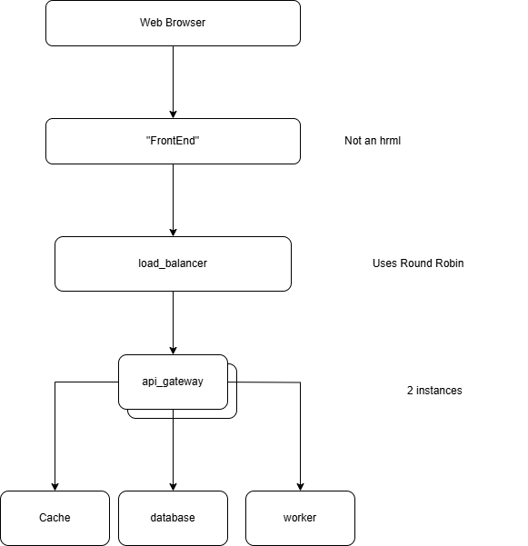
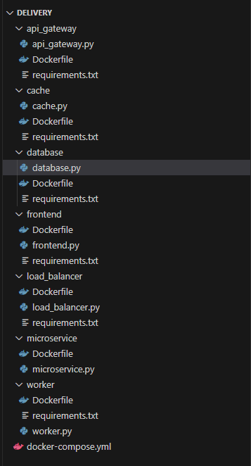
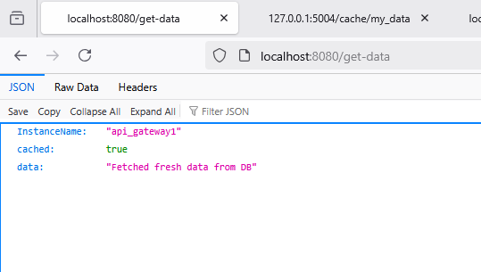
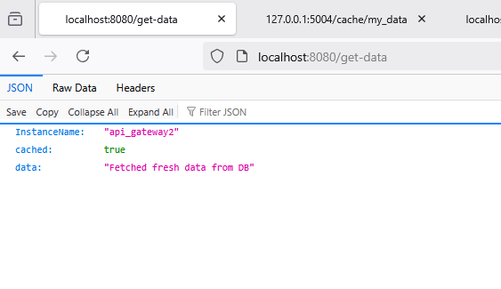
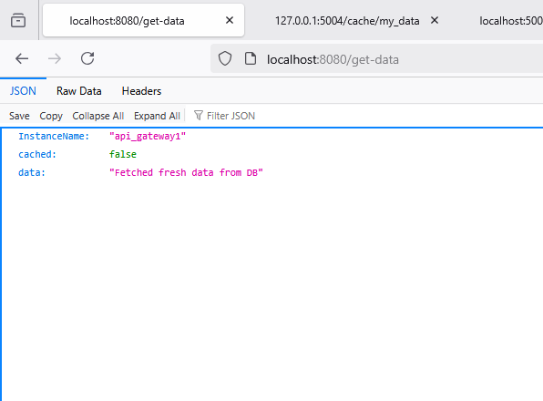
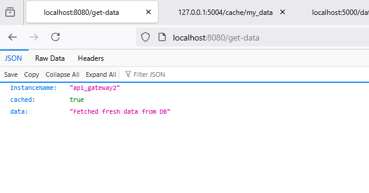
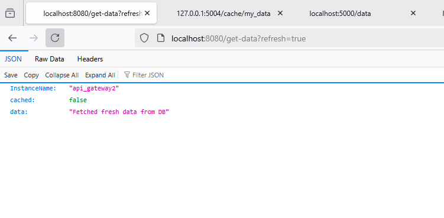

# [LSSA_2025i] - U4 - Laboratory 4

**Nombre:** Andrés Arenas

**Description**

The objective of this lab is to demonstrate how applying Performance and Scalability tactics using architectural patterns such as Load Balancing and Caching can improve the system's responsiveness and
support higher loads.


## Architecture

The next image shows the architecture of the laboratory:



A new component called frontend was created. This is not an UI, but simply calls the loadbalancer that forwards the calls to the api_gateway using Round Robin algoritm.


## Structure of the project to be run on docker:

Screenshot of the project created:




The requested changes are detailed below:

## Testing of the loadbalancing

The returned data will now show the server that is answering the request. This is done by this code:

INSTANCE_NAME = os.environ.get("GATEWAY_ID", "unknown")

The INTANCE_NAME is set on docker-compose.yml :

```yaml
  api_gateway1:
    build: ./api_gateway
    ports:
      - "5000:5000"
    environment:
      - GATEWAY_ID=api_gateway1
    depends_on:
      - cache
      - worker
      - database

  api_gateway2:
    build: ./api_gateway
    ports:
      - "5003:5000"  # Port on host is 5003; internal is still 5000
    environment:
      - GATEWAY_ID=api_gateway2
    depends_on:
      - cache
      - worker
      - database
```


Evidence of the loadbalancing:


Node 1



Node 2




## Testing the Cache


The same GET operation shows the use of the cache. The container was restarted to test it.


Evidence of caching

Below is the response for the first request (after starting the container):




Below is the response for the next request:



The next request will be loaded from Cache.


## Other Cache Pattern : Cache refresh

A cache refresh was implemented to forcefully refresh it. It's forced by the use of the query string parameter refresh (true or false). It's an optional parameter.



This is usefull to ensure that the cache reflex and returns the last changes persisted into the DB.


## And another Cache Pattern : Cache refresh in background

This one is related to the previous one. 

                # Trigger background cache refresh
                Thread(target=refresh_cache_in_background, args=(key,)).start()


And this is the function refresh_cache_in_background :

```python
def refresh_cache_in_background(key):
    try:
        db_resp = requests.get("http://database:5002/db").json()
        requests.post(f"http://cache:5004/cache/{key}", json={'value': db_resp['message']})
    except Exception as e:
        print(f"Background cache refresh failed: {e}")
```

This is usefull to manage an asynchronous update, speeding up the response time.


********