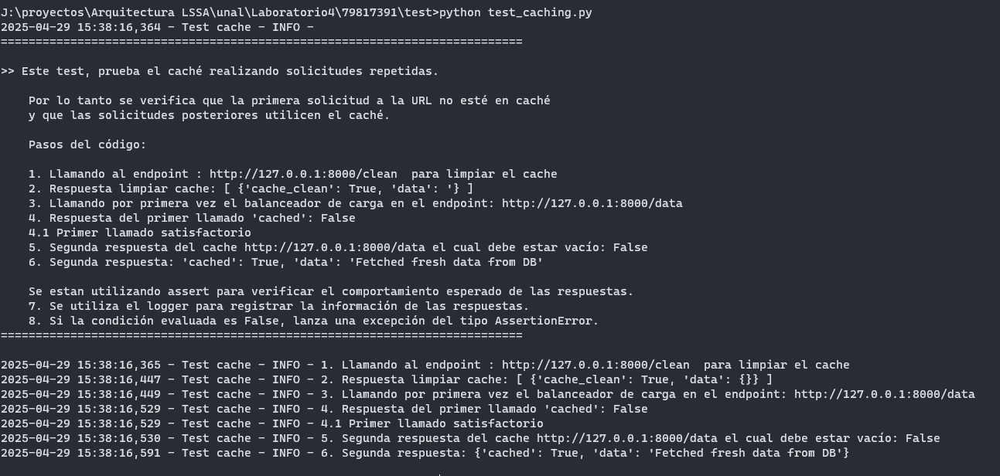
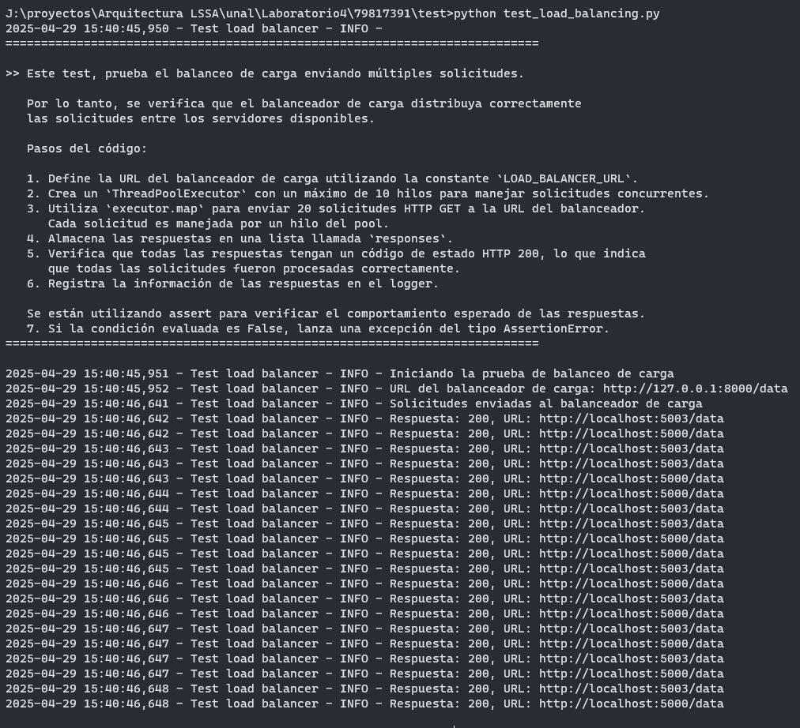

# Laboratorio 4 - Escalabilidad

**Edsson Yannick Bonilla Hernández**

## Objetivo
El objetivo de este laboratorio es demostrar cómo aplicar tácticas de *Rendimiento y Escalabilidad* utilizando patrones arquitectónicos como **Balanceo de Carga** y **Caché**, para mejorar la capacidad de respuesta del sistema y soportar mayores cargas.

---

## Arquitectura de Software a Gran Escala: Elementos de Escalabilidad

### 1. **Balanceo de Carga**
#### **Descripción**
El balanceo de carga es una táctica de escalabilidad que distribuye el tráfico entrante entre múltiples instancias de un servicio para garantizar que ninguna instancia se sobrecargue. Mejora la capacidad de respuesta y la disponibilidad del sistema.

#### **Características**
- **Distribución Round-Robin**: Las solicitudes se distribuyen de manera uniforme entre múltiples instancias del API Gateway.
- **Tolerancia a Fallos**: Si una instancia falla, el balanceador de carga puede redirigir el tráfico a instancias saludables.
- **Escalabilidad Horizontal**: Se pueden agregar nuevas instancias para manejar un aumento en el tráfico.

#### **Implementación**
- Un **Balanceador de Carga** (`load_balancer.py`) implementado con Flask y el módulo `itertools.cycle` de Python para alternar solicitudes entre las instancias del API Gateway.
- Múltiples instancias del **API Gateway** (`api_gateway.py`) ejecutadas en diferentes puertos (por ejemplo, `5000` y `5003`).

#### **Beneficios**
- Evita cuellos de botella al distribuir el tráfico.
- Incrementa la confiabilidad y tolerancia a fallos del sistema.
- Permite escalar horizontalmente al agregar más instancias del API Gateway.

---

### 2. **Caché**
#### **Descripción**
El caché es una táctica de escalabilidad que almacena datos frecuentemente accedidos en una capa de almacenamiento de acceso rápido para reducir la carga en la base de datos y mejorar los tiempos de respuesta.

#### **Características**
- **Almacenamiento en Memoria**: Los datos se almacenan en memoria para un acceso rápido.
- **Aciertos y Fallos de Caché**: Se rastrea si los datos se obtienen del caché o de la base de datos.
- **Expiración de Datos (Opcional)**: Los datos en caché pueden invalidarse o actualizarse cuando sea necesario.

#### **Implementación**
- Un **Servicio de Caché** (`cache.py`) implementado con Flask y un diccionario en memoria para almacenar pares clave-valor.
- El **API Gateway** verifica el caché antes de consultar la base de datos. Si los datos no están en el caché, los obtiene de la base de datos y los almacena en el caché para futuros usos.

#### **Beneficios**
- Reduce las consultas a la base de datos, disminuyendo la latencia y la sobrecarga computacional.
- Mejora los tiempos de respuesta para datos frecuentemente accedidos.
- Aumenta la escalabilidad del sistema al reducir la carga en los servicios de backend.

---

### 3. **Procesamiento Asíncrono**
#### **Descripción**
El procesamiento asíncrono descarga tareas de larga duración o que consumen muchos recursos a un trabajador en segundo plano, permitiendo que el sistema permanezca receptivo a las solicitudes de los usuarios.

#### **Características**
- **Cola de Tareas**: Las tareas se encolan y procesan de forma asíncrona.
- **Ejecución en Hilos**: Las tareas se ejecutan en hilos separados para evitar bloquear la aplicación principal.
- **Ejecución Diferida**: Las tareas pueden procesarse con un retraso, simulando escenarios del mundo real.

#### **Implementación**
- Un **Servicio de Trabajador** (`worker.py`) procesa tareas de forma asíncrona utilizando el módulo `threading` de Python.
- El **API Gateway** enruta las tareas de larga duración al trabajador mediante una solicitud HTTP.

#### **Beneficios**
- Mantiene el sistema receptivo al descargar operaciones costosas.
- Permite al sistema manejar más solicitudes concurrentes.
- Mejora la experiencia del usuario al proporcionar retroalimentación inmediata para tareas en cola.

---

## Mejoras a la Arquitectura Propuesta

### Arquitectura Original (Lab 4)
Cliente → Load Balancer -> API Gateway x2 → Microservicio → Base de Datos

### Arquitectura Escalable Mejorada

### Principales Mejoras
1. **Balanceador de Carga**:
   - Distribuye el tráfico entre múltiples instancias del API Gateway.
   - Evita la sobrecarga de una sola instancia y garantiza alta disponibilidad.

2. **Caché**:
   - Reduce la carga en la base de datos al almacenar datos frecuentemente accedidos en memoria.
   - Mejora los tiempos de respuesta para solicitudes repetidas.

3. **Procesamiento Asíncrono**:
   - Descarga tareas de larga duración a un trabajador en segundo plano.
   - Mantiene el sistema receptivo a las solicitudes de los usuarios.

---

## Pre requisitos

```
   Tener Docker instalado
```

## Pasos para la Ejecución

1. Inicia todos los servicios con el siguiente comando:
   
   Ubicarse en la carpeta raíz del proyecto 79817391\

   ```bash
   docker-compose up --build
   ```

2. Prueba la arquitectura:
   
   Para la prueba se deben ejecutar dos "Test":

   * El primero permite realizar validaciones para probar el caché, para ello se puede hacer realizando solicitudes repetidas.

      * Ruta: 79817391\test\test_caching.py
      * Ejecución: Se debe ubicar en la ruta [ 79817391\test ] y ejecutar el siguiente comando.

   ```bash
   python test_caching.py
   ```
   El comando anterior genera una salida como la siguiente: 

   

   * El segundo permite realizar validaciones para probar el balanceador de carga, para ello se puede probar el balanceo enviando múltiples solicitudes.

      * Ruta: 79817391\test\test_load_balancing.py
      * Ejecución: Se debe ubicar en la ruta 79817391\test y ejecutar el siguiente comando.

   ```bash
   python test_load_balancing.py
   ```
   El comando anterior genera una salida como la siguiente: 

   

## Flujo del Programa

   * El flujo de trabajo del sistema es el siguiente:

   * El cliente envía una solicitud al balanceador de carga.
   * El balanceador de carga distribuye la solicitud entre las instancias del API Gateway.
   * El API Gateway:
     * Verifica si los datos están en el caché.
     * Si los datos no están en el caché, consulta la base de datos y almacena los resultados en el caché.
     * Si es una tarea de larga duración, la envía al trabajador asíncrono.
   * Los microservicios procesan las solicitudes y devuelven las respuestas al cliente.
