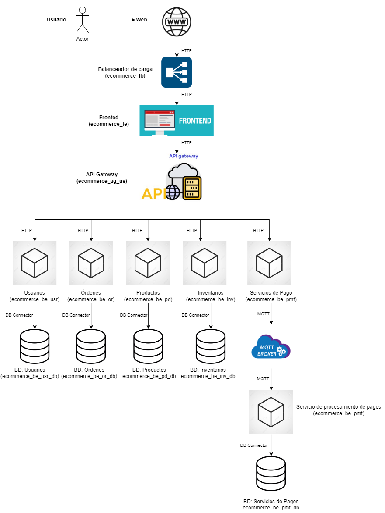

# Arquitectura distribuida basada en microservicios para un e-commerce 

#### Sergio Andrés Cabezas
#### Jilkson Alejandro Pulido Cruz
#### Juan David Ramírez Ávila
#### Diego Alejandro Rodriguez Martinez
#### Yosman Alexis Arenas Jimenez


Esta entrega del proyecto, se enfoca en diseñar arquitectónicamente un sistema de software a gran escala desde un punto de vista estructural. Específicamente, se eligió el dominio de un e-commerce y se modeló como un sistema de un gran número de componentes. Por ello, se optó por una arquitectura distribuida basada en microservicios.

---

## 1. Visión general
La arquitectura propuesta para el sistema de e-commerce se basa en principios de **microservicios desacoplados**, altamente escalables y seguros. El diseño permite gestionar de manera independiente cada dominio de negocio: usuarios, pedidos, productos, inventario y pagos, con comunicación eficiente a través de protocolos adecuados, como HTTP para interacciones tradicionales y MQTT para los eventos relacionados con el servicio de pagos.

El flujo completo desde el cliente hasta el procesamiento de pagos se maneja de forma **modular**, mejorando la resiliencia, seguridad, escalabilidad y mantenibilidad del sistema.

---

## 2. Componentes principales

A continuación, se presenta un diagrama de arquitectura de componentes y conectores. Y posteriormente, una descripción a alto nivel de cada uno de los componentes.



### 2.1. Internet (Clientes)
- Usuarios finales que interactúan con el sistema a través de  un navegador web o un dispositivo móvil.


### 2.2. Load Balancer (ecommerce_lb)
- Componente que actúa como **primera capa de defensa** y distribución de tráfico.
- Balancea la carga entrante entre instancias del **Frontend** (`ecommerce_fe`) para asegurar alta disponibilidad.
- Mejora la tolerancia a fallos y distribuye equitativamente las solicitudes.
- **Protocolo usado**: HTTP.

### 2.3. Frontend (ecommerce_fe)
- Aplicación web que ofrece la **interfaz gráfica** al usuario.
- Se encarga de mostrar productos, gestionar carritos, pagos y confirmar órdenes.
- **No contiene lógica de negocio crítica**; actúa como intermediario enviando solicitudes al **API Gateway**.
- Se comunica exclusivamente mediante **HTTP** con el API Gateway.

### 2.4. API Gateway (ecommerce_ag_us)
- Único punto de entrada a los microservicios internos.
- **Funciones clave**:
  - Enrutamiento de solicitudes.
  - Autenticación y autorización de usuarios y servicios.
  - Limitación de exposición a sistemas internos (Se aplica la táctica de seguridad "Limit Exposure").

- **Comunicación**:
  - HTTP hacia el Backend, es decir, los microservicios definidos en la arquitectura. 
  - MQTP para el servicio de pagos, para el procesamiento y cobro de estos. 

---

## 3. Backend con la lógica de negocio


### 3.1. Microservicio de usuarios (ecommerce_be_usr)
- Servicio dedicado a la gestión de registro de usuarios **Usuarios**:
  - Registrar datos de los usuarios.
- Arquitectura transaccional con integridad ACID en su almacenamiento.
- **Conexión a base de datos**: DB Connector.

### 3.2. Microservicio de órdenes (ecommerce_be_or)
- Servicio dedicado a la gestión de **órdenes de compra**:
  - Crear nuevas órdenes.
  - Consultar estado de órdenes.
  - Actualizar o cancelar órdenes.
- Arquitectura transaccional con integridad ACID en su almacenamiento.
- **Conexión a base de datos**: DB Connector.

### 3.3. Microservicio de productos (ecommerce_be_pd)
- Gestiona el **catálogo de productos**:
  - Altas, bajas y modificaciones de productos.
- Base de datos optimizada para búsquedas rápidas (indexes en campos de nombre, categoría, SKU).

### 3.4. Microservicio de inventarios (ecommerce_be_inv)
- Controla el **stock de productos**:
  - Actualiza existencias después de cada compra o ajuste manual.
  - Permite consultar disponibilidad de productos.
- Puede integrarse en tiempo real con almacenes físicos o ERPs externos mediante API REST o Webhooks en el futuro.

### 3.5. Mircroservicios de pagos (ecommerce_be_pmt)
- Recibe las solicitudes desde el API GateWay y las redirige a un Broker, para que sean consumidas y se realicen operaciones posteriores, referentes al procesamiento de los pagos. 
- Servicio especializado en procesamiento de **pagos**.
- Administra procesos como:
  - Validación de tarjetas.
  - Confirmación de pagos.
  - Emisión de facturas electrónicas (Posible capacidad a integrar en el sistema).
- Almacena los registros en una base de datos, asegurando auditoría y trazabilidad de transacciones.

---

## 4. Almacenamiento de datos

**Modelo de base de datos:**
- Normalización para evitar redundancia.
- Estrategias de partición y replicación para escalabilidad en futuro crecimiento.

---

## 5. Comunicación entre componentes

| Componente origen        | Componente destino            | Protocolo   |
|--------------------------|-------------------------------|--------------|
| Cliente (Internet)       | Load Balancer                 | HTTP         |
| Load Balancer            | Frontend (ecommerce_fe)       | HTTP         |
| Frontend                 | API Gateway (ecommerce_ag_us) | HTTP         |
| API Gateway              | Backend Usuarios              | HTTP         |
| API Gateway              | Backend Órdenes               | HTTP         |
| API Gateway              | Backend Productos             | HTTP         |
| API Gateway              | Backend Inventario            | HTTP         |
| API Gateway              | Servicio de Pagos             | HTTP y MQTT  |
| Backend                  | Base de datos                 | DB Connector |

---

## 6.Beneficios de la arquitectura

- **Escalabilidad Horizontal**: Los componentes del Backen se escalan de forma horizontalmente y de forma independiente según demanda.
- **Alta disponibilidad**: Load Balancer y múltiples instancias aseguran operación continua.
- **Seguridad**: 
  - Frontend no accede directamente a microservicios.
  - API Gateway gestiona autenticación, autorización y protección contra abusos.
- **Desacoplamiento**: cambios en un servicio no afectan a los demás.
- **Flexibilidad tecnológica**: cada servicio puede evolucionar usando distintos stacks tecnológicos si se desea.
- **Optimización de comunicaciones**: uso de MQTT para pagos críticos asegura mínimo retardo en procesos sensibles.

---

## 7.Descripción de los principales archivos 

### 7.1. Archivo arch.tx

Se define la grámitica de un lenguaje para modelar arquitecturas de software con **componentes** (frontend, backend, database, load balancer, API gateway, mqtp) y **conectores** (http, db_connector, message_queue), especificando su tipo y relaciones.


### 7.2. Archivo metamodel.py

Este archivo `metamodel.py` crea un metamodelo a partir de la gramática DSL definida en `arch.tx` utilizando la librería `textx`.

### 7.3. Archivo transformations.py

Este archivo `transformations.py` tiene como objetivo generar automáticamente el esqueleto del sistema que se va a modelar, con los siguientes componentes:

- **Componente de Base de Datos**  
  Se incluyen componentes de base de datos para almacenar y gestionar los datos.

- **Componentes Backend**  
  Se colocan los componentes del backend para manejar la lógica de negocio y las interacciones con la o las base de datos.

- **Componente Frontend**  
  Se encuentra un frontend  para permitir la interacción del usuario con el sistema.

- **Componente de Balanceo de carga**  
  Se incorpora un balanceador de carga para una mejor distribución del tráfico.

- **Componente de  API Gateway**  
  Se incluye un API Gateway para gestionar solicitudes, autenticación, autorización y enrutamiento, y optimizando la comunicación al consolidar múltiples servicios en un solo punto de acceso.

Este esqueleto permite simular la estructura inicial para el desarrollo del sistema y las interacciones entre estos.

### 7.4. Archivo model.arch 

Este archivo muestra los componentes y conectores del sistema.

#### Arquitectura:

- **Frontend (ecommerce_fe)**: Interfaz de usuario.
- **Backends (ecommerce_be_usr, ecommerce_be_or, ecommerce_be_pd, ecommerce_be_inv)**: Gestionan usuarios, pedidos, productos e inventarios.
- **MQTP (ecommerce_be_pmt)**: Maneja pagos.
- **API Gateway (ecommerce_ag_us)**: Enruta las solicitudes al backend adecuado.
- **Base de Datos (ecommerce_be_or_db, ecommerce_be_pd_db, ecommerce_be_inv_db, ecommerce_be_pmt_db)**: Almacenan información de pedidos, productos, inventarios y pagos.
- **Load Balancer (ecommerce_lb)**: Distribuye el tráfico.

#### Conectores:

- **HTTP**
- **DB**
- **MQTP**

### 7.5. Archivo generation.py

El archivo generation.py carga un modelo de arquitectura desde un archivo .arch y aplica transformaciones para generar el esqueleto del sistema utilizando un metamodelo.

## 8. Pruebas y despliegue del esqueleto del sistema 

A continuación, se presentan las instrucciones, para ejecutar, la generación del esqueleto. 

a.Cree un archivo Dockerfile para especificar los requisitos para ejecutar el programa.

```
FROM python:3.11-slim
WORKDIR /app
COPY . .
RUN pip install --no-cache-dir textX mysql-connector-python flask
CMD ["python", "generation.py"]
```

b.  Cree una imagen de Docker desde el archivo Dockerfile.

```
docker build -t lssa-delivery1 .
```

c.  Cree un contenedor de Docker para ejecutar el programa y generar el sistema de software modelado.

```
docker run --rm -v "$PWD:/app lssa-delivery1" 
```

Después de ejecutar el comando anterior, se debería crear un directorio llamado `skeleton`.

d.  Ingrese al directorio /skeleton.

e.  Ejecute el esqueleto generado del sistema de software modelado.

```
docker-compose up --build
```

f.  Verifique los contenedores ejecutados 

```
docker ps -a
```


---

# Recordar eliminar la asignación de responsabilidades 

## E-commerce

### Components: 

 - BD SQL -Postgres 
 - REST components (Orders, User Data) (Replica) - FastAPI
 - Load Balancer - Nginx (Alejandro)
 - API Gateway - Nginx/Header (Alejandro)
 - MQTP - RabbitMQ :=> delay 30s (Yosman)
 - Front Ends - HTML + Bootstrap Fetch (Nginx) (Diego)


 ## Domain

(Authentication, User Info) -> SQL, REST, API GAteway
 User -> id (Juan David)
        name
        isCustomer
        isSeller

CRUD -> REST, SQL
 Product -> id (Alejandro)
             name
             price
             type
             user_id


CRUD -> REST, SQL  
Inventory -> product_id (Diego)
             Quantity
             Region


 [Read, Update] -> SQL
Order -> id (Sergio)
         customer_id
         status
        

order_detail -> order_id (Sergio)
                product_id
                quantity
                total_price


Read/MQTP -> SQL, REST
Payments -> payment_id (Yosman)
            order_id
            payment_method
            total_payment
            transaction_id
            status

