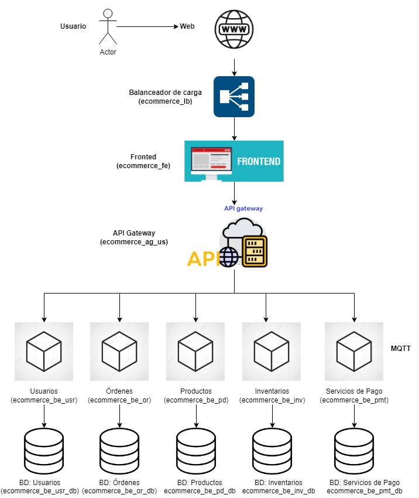

# 📄 Descripción detallada de la arquitectura E-commerce distribuida basada en microservicios

---

## 1. Visión general
La arquitectura propuesta para el sistema de e-commerce se basa en principios de **microservicios desacoplados**, altamente escalables y seguros. El diseño permite gestionar de manera independiente cada dominio de negocio: pedidos, productos, inventario y pagos, con comunicación eficiente a través de protocolos adecuados, como HTTP para interacciones tradicionales y MQTT para eventos de pagos.

El flujo completo desde el cliente hasta el procesamiento de pagos se maneja de forma **modular**, mejorando la resiliencia, escalabilidad y mantenibilidad del sistema.

---

## 2. Componentes principales

### 2.1. Internet (Clientes)
- Usuarios finales que interactúan con el sistema a través de navegadores web o aplicaciones móviles.
- No hay interacción directa con los microservicios: todo tráfico pasa primero por el Load Balancer.

### 2.2. Load Balancer (ecommerce_lb)
- Componente que actúa como **primera capa de defensa** y distribución de tráfico.
- Balancea la carga entrante entre instancias del **Frontend** (`ecommerce_fe`) para asegurar alta disponibilidad.
- Mejora la tolerancia a fallos y distribuye equitativamente las solicitudes.
- **Protocolo usado**: HTTP (puede incluir HTTPS en entornos productivos).

### 2.3. Frontend (ecommerce_fe)
- Aplicación web que ofrece la **interfaz gráfica** al usuario.
- Se encarga de mostrar productos, gestionar carritos, pagos y confirmar órdenes.
- **No contiene lógica de negocio crítica**; actúa como intermediario enviando solicitudes al **API Gateway**.
- Se comunica exclusivamente mediante **HTTP** con el API Gateway.

### 2.4. API Gateway (ecommerce_ag_us)
- Único punto de entrada a los microservicios internos.
- **Funciones clave**:
  - Enrutamiento inteligente de solicitudes.
  - Autenticación y autorización de usuarios y servicios.
  - Limitación de exposición a sistemas internos (tactic "Limit Exposure").
  - Transformación de protocolos y carga de políticas de seguridad (rate limiting, CORS, throttling).
- **Comunicación**:
  - HTTP hacia los Backends de Orders, Products e Inventory.
  - MQTT hacia el Servicio de Pagos.

---

## 3. Backends de negocio

### 3.1. Backend Orders (ecommerce_be_or)
- Servicio dedicado a la gestión de **órdenes de compra**:
  - Crear nuevas órdenes.
  - Consultar estado de órdenes.
  - Actualizar o cancelar órdenes.
- Cada orden persiste en su propia base de datos `ecommerce_be_or_db`.
- Arquitectura transaccional con integridad ACID en su almacenamiento.
- **Conexión a base de datos**: DB Connector.

### 3.2. Backend Products (ecommerce_be_pd)
- Gestiona el **catálogo de productos**:
  - Altas, bajas y modificaciones de productos.
  - Consulta de inventario relacionado.
- Utiliza su propia base de datos `ecommerce_be_pd_db`.
- Base de datos optimizada para búsquedas rápidas (indexes en campos de nombre, categoría, SKU).

### 3.3. Backend Inventory (ecommerce_be_inv)
- Controla el **stock de productos**:
  - Actualiza existencias después de cada compra o ajuste manual.
  - Permite consultar disponibilidad de productos.
- Persistencia en `ecommerce_be_inv_db`.
- Puede integrarse en tiempo real con almacenes físicos o ERPs externos mediante API REST o Webhooks en el futuro.

### 3.4. Payment Service (ecommerce_be_pmt)
- Servicio especializado en procesamiento de **pagos**.
- Comunicación a través de **MQTT**, debido a:
  - Naturaleza asíncrona de eventos de pago.
  - Necesidad de procesamiento rápido, bajo consumo de ancho de banda.
- Administra procesos como:
  - Validación de tarjetas.
  - Confirmación de pagos.
  - Emisión de facturas electrónicas (futuro).
- Almacena los registros en `ecommerce_be_pmt_db`, asegurando auditoría y trazabilidad de transacciones.

---

## 4. Bases de datos

Cada servicio maneja su propio almacén de datos aislado:
- **Orders DB** → `ecommerce_be_or_db`
- **Products DB** → `ecommerce_be_pd_db`
- **Inventory DB** → `ecommerce_be_inv_db`
- **Payments DB** → `ecommerce_be_pmt_db`

**Modelo de base de datos:**
- Normalización para evitar redundancia.
- Estrategias de partición y replicación para escalabilidad en futuro crecimiento.

---

## 5. Comunicación entre componentes

| Componente origen       | Componente destino            | Protocolo |
|--------------------------|-------------------------------|-----------|
| Cliente (Internet)       | Load Balancer                 | HTTP      |
| Load Balancer            | Frontend (ecommerce_fe)       | HTTP      |
| Frontend                 | API Gateway (ecommerce_ag_us) | HTTP      |
| API Gateway              | Backend Orders                | HTTP      |
| API Gateway              | Backend Products              | HTTP      |
| API Gateway              | Backend Inventory             | HTTP      |
| API Gateway              | Payment Service               | MQTT      |
| Cada Backend             | Su Base de Datos propia       | DB Connector |

---

# 🎯 Beneficios de esta arquitectura

- **Escalabilidad Horizontal**: cualquier backend o base de datos puede escalar independientemente según demanda.
- **Alta disponibilidad**: Load Balancer y múltiples instancias aseguran operación continua.
- **Seguridad**: 
  - Frontend no accede directamente a microservicios.
  - API Gateway gestiona autenticación, autorización y protección contra abusos.
- **Desacoplamiento**: cambios en un servicio no afectan a los demás.
- **Flexibilidad tecnológica**: cada servicio puede evolucionar usando distintos stacks tecnológicos si se desea.
- **Optimización de comunicaciones**: uso de MQTT para pagos críticos asegura mínimo retardo en procesos sensibles.

---

# 📈 Posibles mejoras a futuro

- **Circuit Breakers** y **Retries** en API Gateway para manejo de fallos.
- **Cacheo de productos** en CDN para mejorar performance de catálogos.
- **Observabilidad** agregando tracing distribuido, logging estructurado y métricas por servicio.
- **Sistema de colas** adicional (SQS, Kafka) para eventos como actualización de stock masiva.

---

# 🖼️ Resumen final del flujo

# Recordar eliminar la asignación de responsabilidades 

## E-commerce

### Components: 

 - BD SQL -Postgres 
 - REST components (Orders, User Data) (Replica) - FastAPI
 - Load Balancer - Nginx (Alejandro)
 - API Gateway - Nginx/Header (Alejandro)
 - MQTP - RabbitMQ :=> delay 30s (Yosman)
 - Front Ends - HTML + Bootstrap Fetch (Nginx) (Diego)

 ## Domain

(Authentication, User Info) -> SQL, REST, API GAteway
 User -> id (Juan David)
        name
        isCustomer
        isSeller

CRUD -> REST, SQL
 Product -> id (Alejandro)
             name
             price
             type
             user_id

CRUD -> REST, SQL  
Inventory -> product_id (Diego)
             Quantity
             Region

 [Read, Update] -> SQL
Order -> id (Sergio)
         customer_id
         status
        

order_detail -> order_id (Sergio)
                product_id
                quantity
                total_price

Read/MQTP -> SQL, REST
Payments -> payment_id (Yosman)
            order_id
            payment_method
            total_payment
            transaction_id
            status

