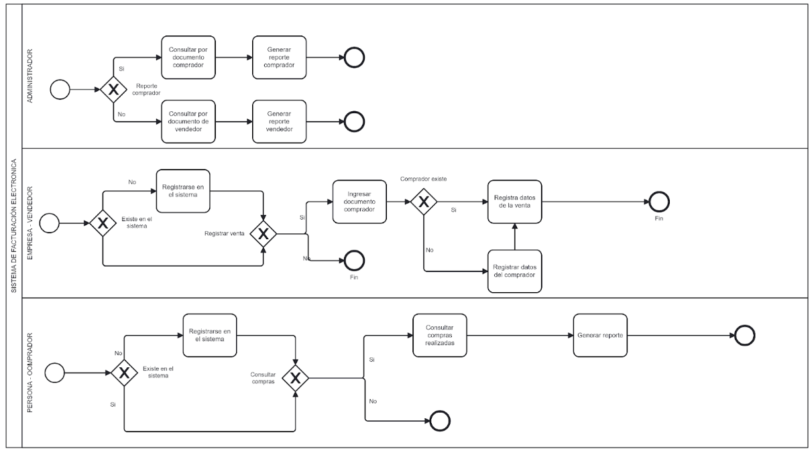
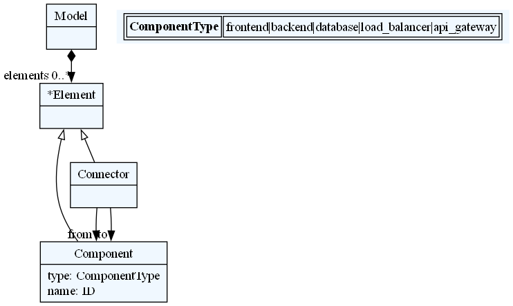

# Large-Scale Software Architecture - Universidad Nacional de Colombia 
## Project - Delivery 1 - Team 1
#### Integrantes
- Carlos Arévalo
- Edsson Bonilla
- Nancy VianethVera Rodríguez
- Sebastián Ríos Sabogal
- Yilver Alirio Ramírez Ochoa - 1015994056
- Julián Ricardo Beltrán Lizarazo - 1023949483

## Contexto del Sistema de Software
Para el proyecto se trabajará con prototipo simple del sistema de facturación electrónica, entendiendo este como el conjunto de procesos que permiten detallar las transacciones entre compradores y vendedores. El objetivo de este sistema es consolidar las obligaciones tributarias de los vendedores y por otra parte, permitir a los compradores conocer las facturas emitidas a su nombre a fin de poder usarlas para beneficios tributarios.

El sistema de facturación electrónica es un sistema a gran escala porque tiene alta transaccionalidad. De acuerdo con los datos de la entidad, entre julio y noviembre del año pasado se reportaron a la Dian más de tres mil millones de facturas electrónicas, lo cual equivale a más de 20 millones de facturas diarias. Esta cantidad está en aumento, dado que se seguirán incluyendo documentos equivalentes y tipos de transacción como: comprobantes de peaje, impuesto nacional de consumo, todas las actividades comerciales de personas o entidades, todas las actividades que ejerzan profesiones liberales, transacciones relacionadas con venta de bienes derivados de la actividad agrícola, entre otros. 

Aunque el sistema de facturación electrónica contempla diversas funcionalidades, para el prototipo a desarrollar se considera un flujo básico en donde es posible que un comprador o un vendedor se pueda registrar en el sistema; así mismo que sea posible registrar facturas electrónicas (con datos básicos), y que un rol administrador pueda consultar facturas bien sea por comprador o por vendedor.

Este  flujo simplificado, se representa en el siguiente gráfico:

Para este prototipo, se consideró un modelo de datos sencillo que permita validar la funcionalidad general del sistema. Para ello se establecieron los datos básicos así:

**Usuario**
| Campo       | Tipo    |
|-------------|---------|
| id          | Integer |
| name        | String  |
| role_name   | String  |
| doc_id      | String  |

**Factura electrónica**
| Campo       | Tipo    |
|-------------|---------|
| id          | Integer |
| date        | String  |
| seller_id   | String  |
| buyer_id    | String  |
| sell_amount | String  |
| tax_amount  | String  |

## Diseño arquitectónico

El diseño arquitectónico para este prototipo se ilustra a continuación

### Diagrama de Componentes

mermaid
graph TD
    Start@{ shape: circle, label: "Client" }
    
    admin_fe["admin_fe"]
    register_fe["register_fe"]
    seller_fe["seller_fe"]

    users_lb["users_lb"]
    efact_reading_lb["efact_reading_lb"]
    efact_writing_lb["efact_writing_lb"]

    auth_be["auth_be"]
    users_be["users_be"]
    efact_reading_be["efact_reading_be"]
    efact_writing_be["efact_writing_be"]

    users_db[(users_db)]
    efact_reading_db[(efact_reading_db)]
    efact_writing_db[(efact_writing_db)]

    Start --> Frontend

    subgraph Public Network
        subgraph API Gateway
            efact_ag["efact_ag"]
        end
        subgraph Frontend
            register_fe --> |http| efact_ag
            seller_fe --> |http| efact_ag
            admin_fe --> |http| efact_ag
        end
    end

    subgraph Private Network
        subgraph Authorization
            efact_ag --> |http| auth_be
        end

        auth_be --> |http| users_lb

        subgraph Load Balancer
            efact_ag --> |http| users_lb
            efact_ag --> |http| efact_writing_lb
            efact_ag --> |http| efact_reading_lb
        end

        subgraph Microservice
            users_lb --> |lb_conn| users_be
            efact_writing_lb --> |lb_conn| efact_writing_be
            efact_reading_lb --> |lb_conn| efact_reading_be
        end

        subgraph Database
            users_be --> |db_conn| users_db
            efact_writing_be --> |db_conn| efact_writing_db
            efact_reading_be --> |db_conn| efact_reading_db
        end
    end

### Tabla de componentes
| Tipo               | Componente                | Descripción                                   |
|--------------------|---------------------------|-----------------------------------------------|
| **Frontend**       | register_fe               | Frontend para registro de usuarios           |
| **Frontend**       | seller_fe                 | Frontend para vendedores                     |
| **Frontend**       | admin_fe                  | Frontend para administración                 |
| **API Gateway**    | efact_ag                  | API Gateway para la gestión                  |
| **Backend**        | auth_be                   | Backend para autenticación                   |
| **Load Balancer**  | users_lb                  | Load balancer para usuarios                  |
| **Load Balancer**  | efact_writing_lb          | Load balancer para escritura                 |
| **Load Balancer**  | efact_reading_lb          | Load balancer para lectura                   |
| **Backend**        | users_be                  | Backend para usuarios                        |
| **Backend**        | efact_writing_be          | Backend para escritura                       |
| **Backend**        | efact_reading_be          | Backend para lectura                         |
| **Database**       | users_db                  | Base de datos para usuarios                  |
| **Database**       | efact_writing_db          | Base de datos para escritura                 |
| **Database**       | efact_reading_db          | Base de datos para lectura                   |
| **Conector**       | register_fe -> efact_ag   | Conexión HTTP entre frontend y API Gateway   |
| **Conector**       | seller_fe -> efact_ag     | Conexión HTTP entre frontend y API Gateway   |
| **Conector**       | admin_fe -> efact_ag      | Conexión HTTP entre frontend y API Gateway   |
| **Conector**       | efact_ag -> auth_be       | Conexión HTTP entre API Gateway y backend de autenticación |
| **Conector**       | efact_ag -> users_lb      | Conexión HTTP entre API Gateway y load balancer de usuarios |
| **Conector**       | efact_ag -> efact_writing_lb | Conexión HTTP entre API Gateway y load balancer de escritura |
| **Conector**       | efact_ag -> efact_reading_lb | Conexión HTTP entre API Gateway y load balancer de lectura |
| **Conector**       | users_lb -> users_be      | Conexión de load balancer a backend de usuarios |
| **Conector**       | efact_writing_lb -> efact_writing_be | Conexión de load balancer a backend de escritura |
| **Conector**       | efact_reading_lb -> efact_reading_be | Conexión de load balancer a backend de lectura |
| **Conector**       | users_be -> users_db      | Conexión de backend de usuarios a base de datos de usuarios |
| **Conector**       | efact_writing_be -> efact_writing_db | Conexión de backend de escritura a base de datos de escritura |
| **Conector**       | efact_reading_be -> efact_reading_db | Conexión de backend de lectura a base de datos de lectura |

### Metamodelo
Para el metamodelo se mantuvo un diseño simple de la gramática, que permite definir componentes y conectores, cada uno con su tipo respectivo. Para el alcance actual del proyecto, esta gramática es suficiente para describir la arquitectura del sistema.

mermaid
graph TD

Model:
    'architecture' ':' elements*=Element
;

Element:
    Component | Connector
;

Component:
    'component' type=ComponentType name=ID
;

Connector:
    'connector' type=ConnectorType from=[Component] '->' to=[Component]
;

ComponentType:
    'frontend' | 'backend' | 'database' | 'load_balancer' | 'api_gateway'
;

ConnectorType:
     'http' | 'db_conn' | 'lb_conn'
 ;

La siguiente imagen describe el metamodelo:

### Reglas de transformación
En cuanto a las reglas de transformación, de forma general se cuenta con las siguientes funciones:
- generate_api_gateway(element)
- generate_load_balancer(element, target)
- generate_microservice(element)
- generate_database(element)
- apply_transformations(model)
- Otras funciones auxiliares

Estas funciones son utilizadas de acuerdo con el siguiente flujo:
- appy_transformations es llamada y se encarga de terar a través de todos los elementos (componentes y conectores) del modelo.
- Dependiendo del elemento que se tenga en cada iteración, se llama la función correspondiente.
    - generate_microservice: Genera el código para el microservicio, utilizando variables de ambiente para realizar los reemplazos necesarios.
    - generate_dabase: Genera el código para la base de datos, que incluye los scripts de inicialización.
    - generate_api_gateway: Genera el código para el API Gateway.
    - generate_load_balancers: Identifica las relaciones entre los componentes a través de los conectores y genera el código correspondiente para manejarlas según corresponda.

Para cada una de estas funciones, se hace uso de plantillas que contienen el código para cada componente, lo cual permite una mantenibilidad y legibilidad mayor del sistema.

Esto nos permite realizar una práctica transformación de nuestro modelo a un artefacto funcional a partir de lo definido, con un nivel de flexibilidad considerable, que facilita agregar componentes similares al sistema.

### Modelo
El modelo describe la arquitectura diseñada de acuerdo con el metamodelo definido.
architecture:

    component frontend register_fe
    component frontend seller_fe
    component frontend admin_fe

    component api_gateway efact_ag

    component backend auth_be

    component load_balancer users_lb
    component load_balancer efact_writing_lb
    component load_balancer efact_reading_lb

    component backend users_be
    component backend efact_writing_be
    component backend efact_reading_be

    component database users_db
    component database efact_writing_db
    component database efact_reading_db

    connector http register_fe -> efact_ag
    connector http seller_fe -> efact_ag
    connector http admin_fe -> efact_ag

    connector http efact_ag -> auth_be

    connector http efact_ag -> users_lb
    connector http efact_ag -> efact_writing_lb
    connector http efact_ag -> efact_writing_lb
    connector http efact_ag -> efact_reading_lb

    connector lb_conn users_lb -> users_be
    connector lb_conn efact_writing_lb -> efact_writing_be
    connector lb_conn efact_reading_lb -> efact_reading_be

    connector db_conn users_be -> users_db
    connector db_conn efact_writing_be -> efact_writing_db
    connector db_conn efact_reading_be -> efact_reading_db

### Skeleton
### Instrucciones de ejecución
El proyecto está configurado para ser ejecutado en Docker a través de Docker-compose.
#### Requisitos
- Python 3.x
- Docker compose
- TODO: Listar resto de dependencias y/o crear dockerfile para ejecutar el generation.py
#### Ejecución
Considerando la carpeta facturacion_electronica como la raíz del proyecto, situándose en la ruta /src, ejecutar los siguientes comandos:
- py .\generation.py
- docker-compose up --build
### Uso/Pruebas
#### Prototipo
Para la primera entrega del prototipo, se implementó la estructura general que permitirá la generación automática del skeleton, asegurándose de que se realice la creación de elementos de diferente tipo: Front end, Api Gateway, Load Balancer, Back end y Bases de datos. 

De forma inicial, los componentes que se encuentran implementados son los resaltados en verde en el diagrama, también listados en la tabla.
mermaid
graph TD
    Start@{ shape: circle, label: "Client" }
    
    admin_fe["admin_fe"]
    register_fe["register_fe"]
    seller_fe["seller_fe"]

    users_lb["users_lb"]
    efact_reading_lb["efact_reading_lb"]
    efact_writing_lb["efact_writing_lb"]

    auth_be["auth_be"]
    users_be["users_be"]
    efact_reading_be["efact_reading_be"]
    efact_writing_be["efact_writing_be"]

    users_db[(users_db)]
    efact_reading_db[(efact_reading_db)]
    efact_writing_db[(efact_writing_db)]

    Start --> Frontend

    subgraph Public Network
        subgraph API Gateway
            efact_ag["efact_ag"]
        end
        subgraph Frontend
            register_fe --> |http| efact_ag
            seller_fe --> |http| efact_ag
            admin_fe --> |http| efact_ag
        end
    end

    subgraph Private Network
        subgraph Authorization
            efact_ag --> |http| auth_be
        end

        auth_be --> |http| users_lb

        subgraph Load Balancer
            efact_ag --> |http| users_lb
            efact_ag --> |http| efact_writing_lb
            efact_ag --> |http| efact_reading_lb
        end

        subgraph Microservice
            users_lb --> |lb_conn| users_be
            efact_writing_lb --> |lb_conn| efact_writing_be
            efact_reading_lb --> |lb_conn| efact_reading_be
        end

        subgraph Database
            users_be --> |db_conn| users_db
            efact_writing_be --> |db_conn| efact_writing_db
            efact_reading_be --> |db_conn| efact_reading_db
        end
    end

    %% Custom styles
    style admin_fe stroke:#14a636,stroke-width:2px
    style register_fe stroke:#14a636,stroke-width:2px
    style efact_ag stroke:#14a636,stroke-width:2px
    style auth_be stroke:#14a636,stroke-width:2px
    style users_lb stroke:#14a636,stroke-width:2px
    style users_be stroke:#14a636,stroke-width:2px
    style users_db stroke:#14a636,stroke-width:2px

| Tipo               | Componente                | Descripción                                   |
|--------------------|---------------------------|-----------------------------------------------|
| **Frontend**       | register_fe               | Frontend para registro de usuarios           |
| **Frontend**       | admin_fe                  | Frontend para administración                 |
| **API Gateway**    | efact_ag                  | API Gateway para la gestión                  |
| **Backend**        | auth_be                   | Backend para autenticación                   |
| **Load Balancer**  | users_lb                  | Load balancer para usuarios                  |
| **Backend**        | users_be                  | Backend para usuarios                        |
| **Database**       | users_db                  | Base de datos para usuarios                  |
| **Conector**       | register_fe -> efact_ag   | Conexión HTTP entre frontend y API Gateway   |
| **Conector**       | admin_fe -> efact_ag      | Conexión HTTP entre frontend y API Gateway   |
| **Conector**       | efact_ag -> auth_be       | Conexión HTTP entre API Gateway y backend de autenticación |
| **Conector**       | efact_ag -> users_lb      | Conexión HTTP entre API Gateway y load balancer de usuarios |
| **Conector**       | users_lb -> users_be      | Conexión de load balancer a backend de usuarios |
| **Conector**       | users_be -> users_db      | Conexión de backend de usuarios a base de datos de usuarios |

Esto permite la ejecución de dos flujos de negocio a través de los cuales se puede comprobar el funcionamiento de la estructura general de la arquitectura, asegurándose de que se realiza la comunicación entre los diferentes elementos de forma correcta según lo diseñado, es decir, Front - API Gateway - Load Balancer - Backend - Base de datos.

*Nota: A pesar de que en el skeleton se genera código para los otros componentes, ya que se encuentran presentes en la definición del modelo, estos no son funcionales aún.*

##### Registro de usuarios:
- Ruta: http://localhost:5001
- Funcionalidad: Formulario simple que permite el registro de usuarios.
##### Dashboard administrador:
- Ruta: http://localhost:5003
- Funcionalidad: Consulta del listado de usuarios de la base de datos.

Por lo tanto, una vez ejecutado el sistema, para comprobar la funcionalidad del mismo, se puede llevar a cabo el siguiente proceso:
- Consultar el *Dashboard de administrador* y notar la cantidad de usuarios existentes en el sistema.
- Ingresar a la página de *Registro de usuarios* y realizar el registro de un usuario.
- Recargar el *Dashboard de administrador* y verificar que el usuario ingresado se encuentre en el listado.

### Conclusiones

