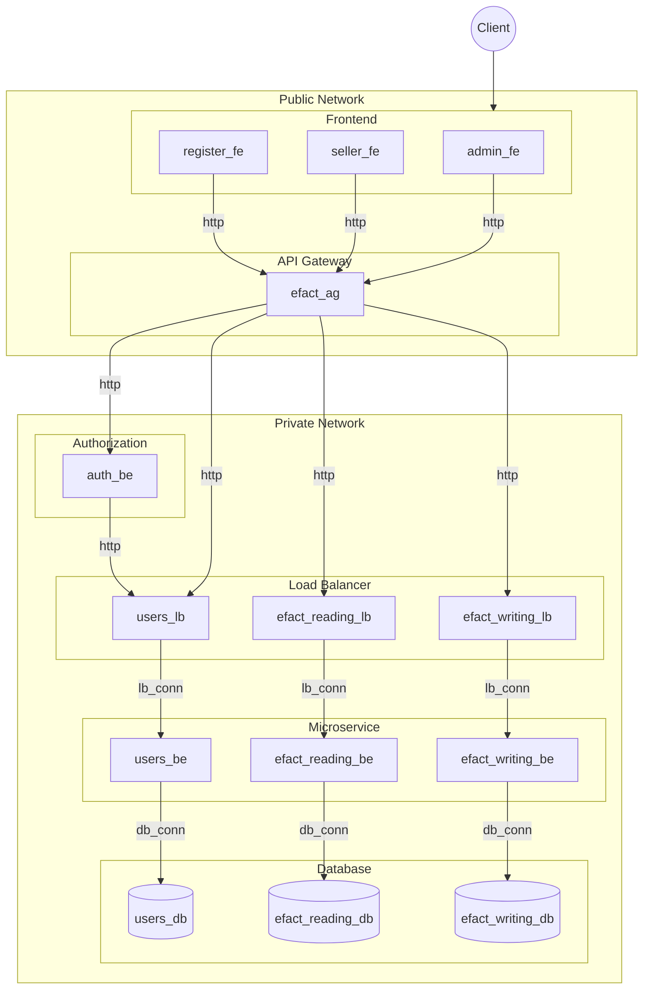

# Large-Scale Software Architecture - Universidad Nacional de Colombia 
## Project - Delivery 1 - Team 1
#### Integrantes
- Carlos Arévalo
- Edsson Bonilla
- Nancy VianethVera Rodríguez
- Sebastián Ríos Sabogal
- Yilver Alirio Ramírez Ochoa
- Julián Ricardo Beltrán Lizarazo - 1023949483

## Contexto del Sistema de Software
Para el proyecto se trabajará con prototipo simple del sistema de facturación electrónica, entendiendo este como el conjunto de procesos que permiten detallar las transacciones entre compradores y vendedores. El objetivo de este sistema es consolidar las obligaciones tributarias de los vendedores y por otra parte, permitir a los compradores conocer las facturas emitidas a su nombre a fin de poder usarlas para beneficios tributarios.

El sistema de facturación electrónica es un sistema a gran escala porque tiene alta transaccionalidad. De acuerdo con los datos de la entidad, entre julio y noviembre del año pasado se reportaron a la Dian más de tres mil millones de facturas electrónicas, lo cual equivale a más de 20 millones de facturas diarias. Esta cantidad está en aumento, dado que se seguirán incluyendo documentos equivalentes y tipos de transacción como: comprobantes de peaje, impuesto nacional de consumo, todas las actividades comerciales de personas o entidades, todas las actividades que ejerzan profesiones liberales, transacciones relacionadas con venta de bienes derivados de la actividad agrícola, entre otros. 

Aunque el sistema de facturación electrónica contempla diversas funcionalidades, para el prototipo a desarrollar se considera un flujo básico en donde es posible que un comprador o un vendedor se pueda registrar en el sistema; así mismo que sea posible registrar facturas electrónicas (con datos básicos), y que un rol administrador pueda consultar facturas bien sea por comprador o por vendedor.

Este  flujo simplificado, se representa en el siguiente gráfico:

Para este prototipo, se consideró un modelo de datos sencillo que permita validar la funcionalidad general del sistema. Para ello se establecieron los datos básicos así:

**Usuario**
| Campo       | Tipo    |
|-------------|---------|
| id          | Integer |
| name        | String  |
| role_name   | String  |
| doc_id      | String  |

**Factura electrónica**
| Campo       | Tipo    |
|-------------|---------|
| id          | Integer |
| date        | String  |
| seller_id   | String  |
| buyer_id    | String  |
| sell_amount | String  |
| tax_amount  | String  |

## Diseño arquitectónico

El diseño arquitectónico para este prototipo se ilustra a continuación

### Diagrama de Componentes

### Tabla de componentes
| Tipo               | Componente                | Descripción                                   |
|--------------------|---------------------------|-----------------------------------------------|
| **Frontend**       | register_fe               | Frontend para registro de usuarios           |
| **Frontend**       | seller_fe                 | Frontend para vendedores                     |
| **Frontend**       | admin_fe                  | Frontend para administración                 |
| **API Gateway**    | efact_ag                  | API Gateway para la gestión                  |
| **Backend**        | auth_be                   | Backend para autenticación                   |
| **Load Balancer**  | users_lb                  | Load balancer para usuarios                  |
| **Load Balancer**  | efact_writing_lb          | Load balancer para escritura                 |
| **Load Balancer**  | efact_reading_lb          | Load balancer para lectura                   |
| **Backend**        | users_be                  | Backend para usuarios                        |
| **Backend**        | efact_writing_be          | Backend para escritura                       |
| **Backend**        | efact_reading_be          | Backend para lectura                         |
| **Database**       | users_db                  | Base de datos para usuarios                  |
| **Database**       | efact_writing_db          | Base de datos para escritura                 |
| **Database**       | efact_reading_db          | Base de datos para lectura                   |
| **Conector**       | register_fe -> efact_ag   | Conexión HTTP entre frontend y API Gateway   |
| **Conector**       | seller_fe -> efact_ag     | Conexión HTTP entre frontend y API Gateway   |
| **Conector**       | admin_fe -> efact_ag      | Conexión HTTP entre frontend y API Gateway   |
| **Conector**       | efact_ag -> auth_be       | Conexión HTTP entre API Gateway y backend de autenticación |
| **Conector**       | efact_ag -> users_lb      | Conexión HTTP entre API Gateway y load balancer de usuarios |
| **Conector**       | efact_ag -> efact_writing_lb | Conexión HTTP entre API Gateway y load balancer de escritura |
| **Conector**       | efact_ag -> efact_reading_lb | Conexión HTTP entre API Gateway y load balancer de lectura |
| **Conector**       | users_lb -> users_be      | Conexión de load balancer a backend de usuarios |
| **Conector**       | efact_writing_lb -> efact_writing_be | Conexión de load balancer a backend de escritura |
| **Conector**       | efact_reading_lb -> efact_reading_be | Conexión de load balancer a backend de lectura |
| **Conector**       | users_be -> users_db      | Conexión de backend de usuarios a base de datos de usuarios |
| **Conector**       | efact_writing_be -> efact_writing_db | Conexión de backend de escritura a base de datos de escritura |
| **Conector**       | efact_reading_be -> efact_reading_db | Conexión de backend de lectura a base de datos de lectura |

### Metamodelo
### Reglas de transformación
### Modelo
### Skeleton
### Prototipo
### Instrucciones de ejecución
El proyecto está configurado para ser ejecutado en Docker a través de Docker-compose.
#### Requisitos
- Python 3.x
- Docker compose
- TODO: Listar resto de dependencias y/o crear dockerfile para ejecutar el generation.py
#### Ejecución
Considerando la carpeta `facturacion_electronica` como la raíz del proyecto, situándose en la ruta `/src`, ejecutar los siguientes comandos:
- `py .\generation.py`
- `docker-compose up --build`
### Uso/Pruebas
De momento el sistema cuenta con dos módulos front end funcionales, cada uno con una funcionalidad básica que ejecuta el flujo completo a través de los elementos de la arquitectura, es decir, Front - API Gateway - Load Balancer - Backend - Base de datos: 
#### Registro de usuarios:
- Ruta: http://localhost:5001
- Funcionalidad: Formulario simple que permite el registro de usuarios.
#### Dashboard administrador:
- Ruta: http://localhost:5003
- Funcionalidad: Listado de usuarios de la base de datos.

Por lo tanto, para comprobar la funcionalidad del sistema, se puede llevar a cabo el siguiente proceso:
- Consultar el *Dashboard de administrador* y notar la cantidad de usuarios existentes en el sistema.
- Ingresar a la página de *Registro de usuarios* y realizar el registro de un usuario.
- Recargar el *Dashboard de administrador* y verificar que el usuario ingresado se encuentre en el listado.

### Conclusiones