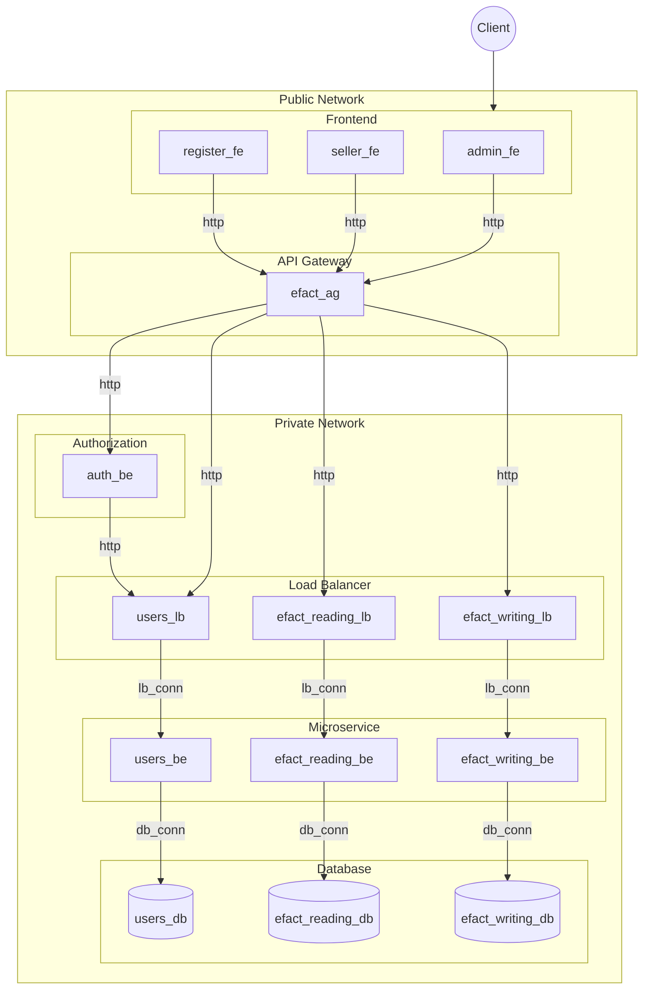

# TODO: Consolidar la documentacion del la primera entrega del proyecto

## Diagrama de Componentes

```mermaid
graph TD
    Start@{ shape: circle, label: "Client" }
    
    admin_fe["admin_fe"]
    register_fe["register_fe"]
    seller_fe["seller_fe"]

    users_lb["users_lb"]
    efact_reading_lb["efact_reading_lb"]
    efact_writing_lb["efact_writing_lb"]

    auth_be["auth_be"]
    users_be["users_be"]
    efact_reading_be["efact_reading_be"]
    efact_writing_be["efact_writing_be"]

    users_db[(users_db)]
    efact_reading_db[(efact_reading_db)]
    efact_writing_db[(efact_writing_db)]

    Start --> Frontend

    subgraph Public Network
        subgraph API Gateway
            efact_ag["efact_ag"]
        end
        subgraph Frontend
            register_fe --> |http| efact_ag
            seller_fe --> |http| efact_ag
            admin_fe --> |http| efact_ag
        end
    end

    subgraph Private Network
        subgraph Authorization
            efact_ag --> |http| auth_be
        end

        auth_be --> |http| users_lb

        subgraph Load Balancer
            efact_ag --> |http| users_lb
            efact_ag --> |http| efact_writing_lb
            efact_ag --> |http| efact_reading_lb
        end

        subgraph Microservice
            users_lb --> |lb_conn| users_be
            efact_writing_lb --> |lb_conn| efact_writing_be
            efact_reading_lb --> |lb_conn| efact_reading_be
        end

        subgraph Database
            users_be --> |db_conn| users_db
            efact_writing_be --> |db_conn| efact_writing_db
            efact_reading_be --> |db_conn| efact_reading_db
        end
    end
```
