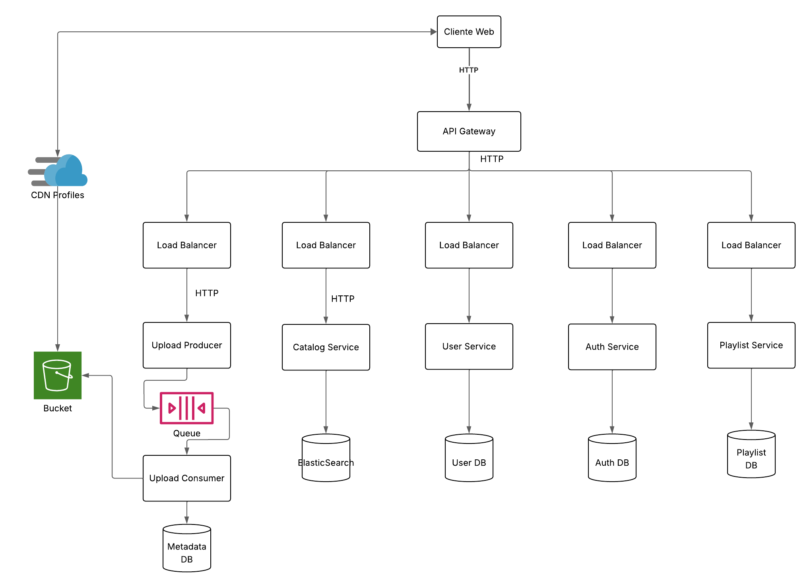

# Spotify-like System Architecture Generator

This project provides a DSL (Domain-Specific Language) and transformation toolset to generate a skeleton for a Spotify-like application architecture.

## Overview

The system uses a model-driven approach to generate the necessary components and connections for a microservices architecture. The generated components are minimal "hello world" implementations.

## Diagram


## Components

- **Frontend**: Simple Node.js/Express web interface
- **Backend**: Simple Flask API service 
- **Database**: Support for MySQL, MongoDB, PostgreSQL, and Elasticsearch
- **LoadBalancer**: Nginx load balancer
-  **CDN**: Nginx-based caching layer responsible for storing and serving song files efficiently to users.
-  **LocalStorage (S3 Emulation)**: Localstack-based S3-compatible storage service used to emulate AWS S3 buckets during development, enabling local upload, retrieval, and management of song files.
- **Music Storage Bucket**: Specific S3 bucket inside the LocalStorage instance dedicated to storing and organizing user-uploaded songs for retrieval by the CDN and other system components.
- **API Gateway**: Simple FastAPI API gateway
- **Queue**: A messaging broker that is used for communication between services in charge of receiving and asynchronous uploading of songs to the S3 bucket.


## Metamodel
```
Model:
    'architecture' ':'
        elements*=Element
;

Element:
    Component | Connector
;

Component:
    LoadBalancer | StandardComponent | Database | ApiGateway
;

LoadBalancer:
    'component' 'loadbalancer' name=ID instanceCount=INT target=[Component]
;

StandardComponent:
    'component' type=StandardComponentType name=ID
;

StandardComponentType:
    'frontend' | 'backend' | 'bucket' | 'cdn' | 'queue'
;

Database:
    'component' 'db' name=ID databaseType=DatabaseType
;

DatabaseType:
    'postgresql' | 'mongodb' | 'elasticsearch'
;

ApiGateway:
    'component' 'api_gateway' name=ID auth=Component
;

Connector:
    'connector' type=ConnectorType from=[Component] '->' to=[Component]
;

ConnectorType:
    'http' | 'db_connector' | 'kafka_connector'
;
```

## Elements
- **Component**: Represents a component in the architecture. It can be a standard component, load balancer, or database.
- **Connector**: Represents a connection link between two components. It can be an HTTP connection, database connection, or Kafka connection.

## Component Types
- **StandardComponent**: Represents a basic deployable service. It can be a frontend, backend, bucket, CDN, or queue.
- **LoadBalancer**: It can be configured with an instance count and a target component to distribute traffic accross multiple instancers of target `Component`.
- **Database**: It can be configured with a specific database type.
- **ApiGateway**: API gateway component that proxies requests to the backend components.


## Connectors

The architecture supports the following connection types:

- **http**: HTTP connection between components (e.g., frontend to backend)
- **db_connector**: Database connection (e.g., backend to database)
- **kafka_connector**: Kafka connection for event streaming (A logic for matching producer and consumer services is included in the connectors)

## Database Support

The system supports multiple database types:
- **mysql**: Default MySQL database 
- **mongodb**: MongoDB NoSQL database
- **postgresql**: PostgreSQL relational database
- **elasticsearch**: Elasticsearch search engine

Example usage in model.arch:
```
component db app_db mongodb
```

## Connection Implementation

When a component is defined as the "from" side of a connector, appropriate code is generated:

- For **http** connectors: Basic HTTP client code is added to connect to the target service
- For **db_connector**: Connection code specific to the database type is added


## Metamodel
- **Model**
    ```
    Model:
    'architecture' ':'
        elements*=Element;
    ```
   The root structure of the architecture. It starts with the keyword architecture and contains a collection of Elements that define the complete system model.

- **Element:**
   ```
      Element:
         Component | Connector ;
   ```
   Base structure of the architecture, representing either a Component (active entity) or a Connector (interaction link between components).

- **Component:**
   ```
      Component:
         LoadBalancer | StandardComponent | Database | ApiGateway ;
   ```
   Abstract definition that groups different types of system elements, such as LoadBalancer, StandardComponent, Database, and ApiGateway.

- **StandardComponent:**

   ```
      StandardComponent:
         'component' type=StandardComponentType name=ID;
   ```
   A basic system component defined by a type (e.g., frontend, backend, bucket, cdn, or queue) and an identifying name. Used to model common system units.

- **StandardComponentType:**
   ```
      StandardComponentType:
         'frontend' | 'backend' | 'bucket' | 'cdn' | 'queue';
   ```
   Enumeration of the available types for StandardComponent, allowing specification as a frontend, backend, bucket, cdn, or queue.


## Transformation Rules:
- **Bucket Transformation Rule**:
This transformation generates the structure for a bucket service based on LocalStack S3. It creates a folder containing:

   1. A Dockerfile that builds a container from the localstack/localstack:s3-latest image, installs necessary tools (awscli, awscli-local), and sets up initialization scripts.

   2. An init-bucket.sh script that automatically creates a bucket named music-storage and uploads an initial song.mp3 file.

   3. A helper function to move external files into the bucket structure, ensuring the test song is available during container initialization.

   This transformation allows seamless simulation of an S3 environment for local development and testing.

- **CDN Transformation Rule**:
This transformation generates the structure for a content delivery service (CDN) using an Nginx proxy server.
It creates a folder containing:

   1. A nginx.conf configuration that sets up a proxy to forward requests to the music_storage service (LocalStack S3) and configures a local cache (proxy_cache) to improve response times and handle stale content.

   2. A Dockerfile that builds a container from the nginx:alpine image, copying the custom configuration and launching Nginx.

   This transformation enables caching of static content (like songs) and reduces the load on the underlying storage by serving frequently accessed resources directly from the cache.

- **Queue Transformation Rule**:
- This transformation generates the structure for a queue service using Kafka. It creates a folder containing:

   1. A Dockerfile that builds a container from the confluentinc/cp-kafka and confluentinc/cp-zookeeper images, setting up the necessary environment variables for Kafka and Zookeeper.

   2. A docker-compose.yml file that defines the Kafka and Zookeeper services, ensuring they are started together.

   3. Analysis of connectors in the model to adapt the backend services according to their connection with the queue.

   This transformation allows for asynchronous communication between services, enabling efficient handling of events and messages in the system.


## Usage

1. Define your architecture in `model.arch`
2. At the spotify_like directory run this command:
   ```
   docker build -t app_delivery1 .
   ```
3. Now build the docker container to execute the program and generate the modeled software system.:
   ```
   docker run --rm -v "$PWD:/app" app_delivery1
   ```
4. The generated skeleton will be available in the `skeleton` directory

5. To run the system:
   ```
   cd skeleton
   docker-compose up --build
   ```

## Example Architecture

```
architecture:
    component frontend app_fe
    component backend app_be
    component db app_db mongodb

    connector http app_fe -> app_be
    connector db_connector app_be -> app_db
    component bucket music_storage
    component cdn songs_cdn
```

This defines a frontend that connects to a backend, which in turn connects to a MongoDB database.


# How to run
1. docker run --rm -v "$(Get-Location):/app" app_delivery1
2. cd .\skeleton\ && docker compose up --build
3. Go to http://localhost:8001/ (frontend)

# Testing the connections
To test the connections, you can use the following commands:

``` bash
curl --location 'localhost:8007/user'
```
``` bash
curl --location 'localhost:8007/playlist'
```
``` bash
curl --location 'localhost:8007/auth'
```
``` bash
curl --location 'localhost:8007/catalog
```
This commands will return some basic information about the backend and the database connection.

Example output:
``` json
{"status_code":200,"content":{"database_connection":"success","message":"Hello World from Backend","type":"PostgreSQL"}}
```