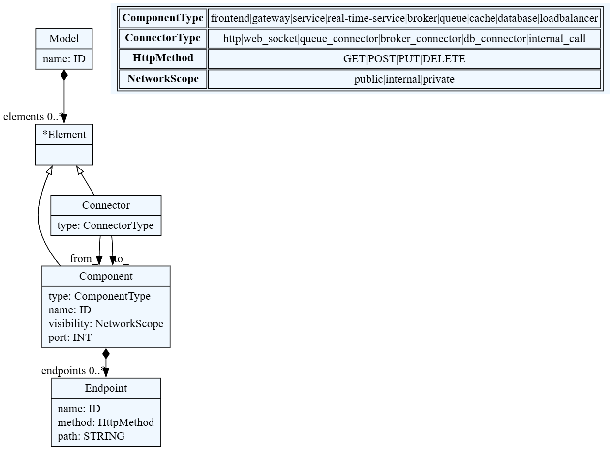
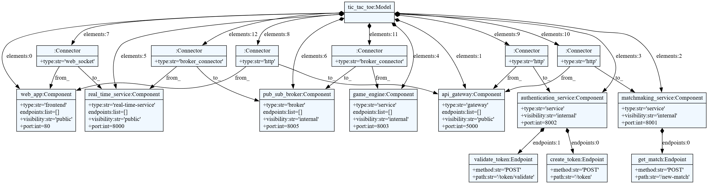
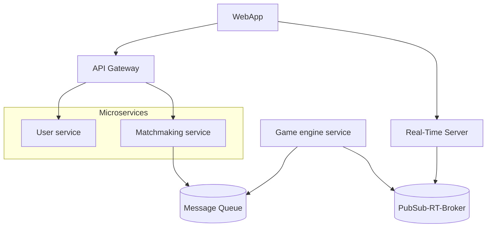
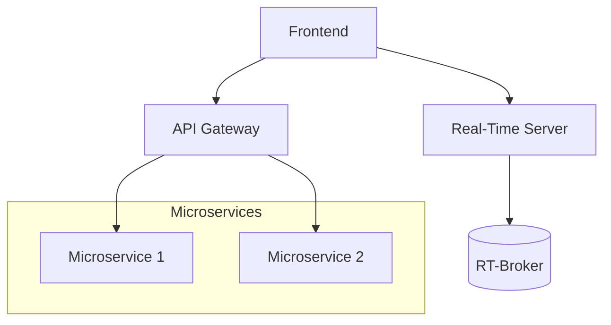

# Project Delivery 1 - Online Real-Time Tic-Tac-Toe Platform

The proposed software system is a real-time, online multiplayer platform that allows users to play the classic game Tic-Tac-Toe or some variants from their web browsers or mobile devices. This platform operates in a concurrent environment, where multiple users can connect, interact, and play games simultaneously.

The system must handle multiple ongoing matches, real-time data synchronization between clients, and user sessions. To ensure a smooth user experience, it requires a robust server-side component that manages game state consistency, conflict resolution, and communication between users.

This system must be scalable to support a growing number of concurrent users, and resilient to handle failures gracefully (e.g., a user disconnects mid-game).

---

## Metamodel

This metamodel describes the structural architecture of a real-time multiplayer TicTacToe system. It supports modeling the main components and the types of connectors between them, using a simple DSL built with textX.

### Grammar Overview

### Model
- Represents the root element (`architecture`)
- Contains a list of elements (components and connectors)

### Component
- Represents a software element that performs a specific function.
- Attributes:
  - `type`: semantic classification (`frontend`, `service`, `database`, etc.)
  - `name`: unique identifier

### Connector
- Represents a connection between two components.
- Attributes:
  - `type`: interaction medium (`http`, `web_socket`, etc.)
  - `from_`: source component
  - `to_`: destination component

### Component types

|Type|Description|
|---|---|
|`frontend`|User interface component, typically running in the browser or mobile app.|
|`gateway`|Entry point to backend services; handles routing, authentication, and request forwarding.|
|`service`|Core logic or application component; performs specific tasks such as matchmaking or game logic.|
|`broker`|Messaging mediator that supports publish-subscribe communication (e.g., MQTT, Kafka, Redis).|
|`queue`|Manages message queues for asynchronous processing (e.g., RabbitMQ, Azure Queue).|
|`cache`|Fast, volatile storage for temporary data (e.g., Redis) used to improve performance.|
|`database`|Persistent storage system for long-term data retention and queries (e.g., PostgreSQL).|
|`loadbalancer`|Distributes incoming traffic across multiple instances of a service for scalability and fault tolerance.|

### Connector types

|Type|Description|
|---|---|
|`http`|Standard REST or HTTP-based communication between components.|
|`web_socket`|Bidirectional real-time connection, often used for live interactions (e.g., game moves).|
|`queue_connector`|Connector to a queue system for message sending/receiving.|
|`broker_connector`|Subscription-based connector to a messaging broker for event-driven communication.|
|`db_connector`|Access path from a component to a database (e.g., SQL query interface).|
|`internal_call`|Internal, synchronous communication between backend components.|

### Design Notes
- This metamodel intentionally omits ports and low-level interaction details for simplicity.
- It supports quick modeling and visualization of software architectures with low overhead.

### Metamodel diagram

---

## Model

## Architecture Diagram

---

### Arquitectura simplificada (Carpeta template)

