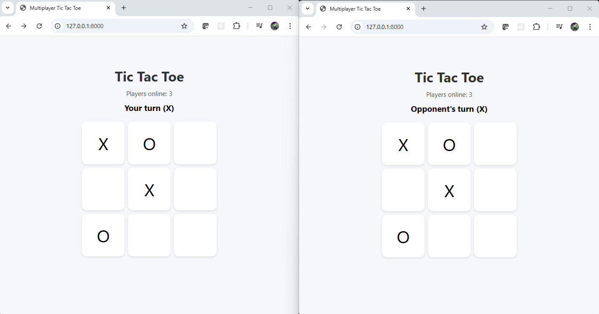
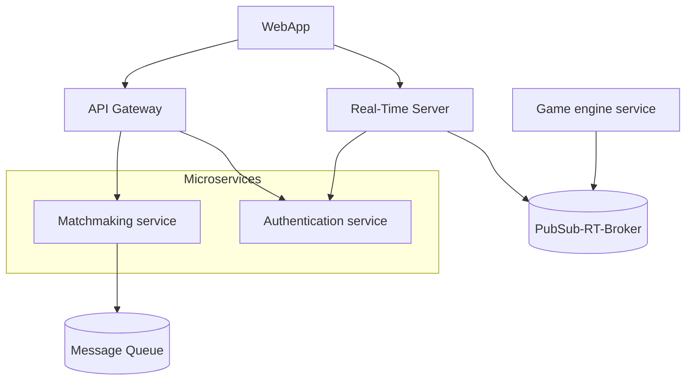

### Team Members:

- Andrés Arenas
- Cristian Camilo Triana Garcia
- Daniel Estivenson Dorado Lame
- Daniel Santiago Mendoza Morales
- Juan B Benavides R
- Santiago Suarez

# Project Delivery 1 - Online Real-Time Tic-Tac-Toe Platform

The proposed software system is a real-time, online multiplayer platform that allows users to play the classic game Tic-Tac-Toe or some variants from their web browsers or mobile devices. This platform operates in a concurrent environment, where multiple users can connect, interact, and play games simultaneously.

The system must handle multiple ongoing matches, real-time data synchronization between clients, and user sessions. To ensure a smooth user experience, it requires a robust server-side component that manages game state consistency, conflict resolution, and communication between users.

This system must be scalable to support a growing number of concurrent users, and resilient to handle failures gracefully (e.g., a user disconnects mid-game).

---

## How to Run

> **Environment**: Linux, macOS, or Windows with WSL (Windows Subsystem for Linux)

### Prerequisites

- [Docker](https://www.docker.com/) installed and running.
- [Make](https://www.gnu.org/software/make/) available in your system.

### Steps

1. **Build and Generate the Skeleton**

   From the project root directory, execute:

   ```bash
   make build
   make generate
   ```

2. **Start the Environment**

   Navigate to the generated skeleton folder:

   ```bash
   cd ./skeleton
   ```

   Then start the Docker containers:

   ```bash
   docker compose up --build -d
   ```

3. **Access the Application**

   Once the containers are up, open your browser and go to: http://localhost:80

### Notes

- Ensure Docker is properly running before starting the environment.
- The `make` utility is typically pre-installed on Linux and macOS. For Windows WSL users, install it via your package manager (e.g., `sudo apt install make` for Ubuntu).

---

## Metamodel

This metamodel describes the structural architecture of a real-time multiplayer TicTacToe system. It supports modeling the main components, their communication connectors, and exposed endpoints using a simple DSL built with textX.

### Grammar Overview

#### Model

- Represents the root element (`architecture`).
- Contains a list of elements (components and connectors).

#### Element

- Abstract grouping that can represent either a `Component` or a `Connector`.

#### Component

- Represents a software element that performs a specific function.
- Attributes:
  - `type`: semantic classification (`frontend`, `service`, `real-time-service`, `database`, etc.).
  - `name`: unique identifier.
  - **Optional Block**:
    - `endpoints`: list of exposed endpoints, useful for modeling API interfaces.
    - `visibility`: network scope (`public`, `internal`, `private`) indicating the component’s exposure level.
    - `port`: port number associated with the component.

#### Connector

- Represents a connection between two components.
- Attributes:
  - `type`: interaction medium (`http`, `web_socket`, etc.).
  - `from_`: source component.
  - `to_`: destination component.

#### Endpoint

- Represents an HTTP operation exposed by a component.
- Attributes:
  - `name`: identifier of the endpoint.
  - `method`: HTTP method (`GET`, `POST`, `PUT`, `DELETE`).
  - `path`: URL path as a string.

### Component Types

| Type               | Description                                                                                              |
| ------------------ | -------------------------------------------------------------------------------------------------------- |
| `frontend`         | User interface component, typically running in the browser or mobile app.                                |
| `gateway`          | Entry point to backend services; handles routing, authentication, and request forwarding.                |
| `service`          | Core logic or application component; performs tasks such as matchmaking or game logic.                   |
| `real-time-service`| Specialized service for handling real-time interactions (e.g., WebSocket servers).                        |
| `broker`           | Messaging mediator supporting publish-subscribe communication (e.g., MQTT, Kafka, Redis).                |
| `queue`            | Manages message queues for asynchronous processing (e.g., RabbitMQ, Azure Queue Storage).                 |
| `cache`            | Fast, volatile storage for temporary data (e.g., Redis) used to improve performance.                      |
| `database`         | Persistent storage system for long-term data retention and queries (e.g., PostgreSQL, MongoDB).           |
| `loadbalancer`     | Distributes incoming traffic across multiple instances of a service for scalability and fault tolerance. |

### Connector Types

| Type               | Description                                                                              |
| ------------------ | ---------------------------------------------------------------------------------------- |
| `http`             | Standard REST or HTTP-based communication between components.                            |
| `web_socket`       | Bidirectional real-time connection, used for live interactions such as game moves.        |
| `queue_connector`  | Connection to a queue system for asynchronous message passing.                           |
| `broker_connector` | Subscription-based connection to a broker for event-driven communication.                |
| `db_connector`     | Access from a component to a database system.                                              |
| `internal_call`    | Internal synchronous communication between backend components.                           |

### HTTP Methods

| Method  | Description                            |
| ------- | -------------------------------------- |
| `GET`   | Retrieve information.                  |
| `POST`  | Submit new data.                        |
| `PUT`   | Update existing data.                   |
| `DELETE`| Remove existing data.                   |

### Network Scopes

| Scope    | Description                                                   |
| -------- | ------------------------------------------------------------- |
| `public` | Exposed to the external internet or external clients.          |
| `internal` | Restricted to the internal network or trusted systems.       |
| `private` | Highly restricted, limited to specific internal components.  |

### Design Notes

- This metamodel intentionally omits low-level protocol configurations, security policies, or detailed service contracts for simplicity.
- It focuses on high-level structural modeling to enable quick visualization and reasoning about system architecture.
- The addition of `endpoints`, `visibility`, and `port` attributes allows better modeling of external interfaces and deployment configurations.

### Metamodel diagram


---

## Model

The following model, defined in the `model.arch` file, describes the initial MVP architecture for a real-time multiplayer **TicTacToe** system. It focuses on supporting basic real-time communication and core game logic processing.

### Components

- **frontend `web_app`**
  Public web app (port `80`) for player interactions.

- **gateway `api_gateway`**
  Public API gateway (port `5000`) routing requests to backend services.

- **service `matchmaking_service`**
  Internal service (port `8001`) offering a POST `/new-match` endpoint.

- **service `authentication_service`**
  Internal service (port `8002`) exposing POST `/token` and `/token/validate` endpoints for authentication.

- **service `game_engine`**
  Internal service (port `8003`) managing core game logic.

- **real-time-service `real_time_service`**
  Public real-time server (port `8000`) handling WebSocket communication.

- **broker `pub_sub_broker`**
  Internal broker (port `8005`) enabling pub-sub communication between services.

### Connectors

- **WebSocket**: `web_app` → `real_time_service`
- **HTTP**:
  - `web_app` → `api_gateway`
  - `api_gateway` → `authentication_service`
  - `api_gateway` → `matchmaking_service`
- **Broker Connector**:
  - `game_engine` → `pub_sub_broker`
  - `real_time_service` → `pub_sub_broker`

### Design Aspects

- Clear separation between frontend, gateway, services, and real-time layers.
- Event-driven communication via pub/sub broker.
- WebSocket support for real-time gameplay updates.
- Public/internal network segmentation for enhanced security.

### Model diagram


---

## Transformations

The corresponding transformations for the different component types follow the next structure:

- In the templates folder, the different files and folders for each component type template are stored.

- In the transformations folder we have a file name templates.py, in this file we have three different util functions for handling the templates during the different transformations.

  - \_make_dir: Create the storage location for a given component.

  - \_copy_template: Copy the file and folder structure of a given component template into the component directory. Replace into the template files the different parameters given as input.

  - generate_templated_component: Use \_make_dir and \_copy_template functions to create a component.

- In the transformations folder, there is a transformation file for each component, each of these files implements a function that decorates over the generate_templated_component function for each particular case.

- In the **init**.py file inside the transformations folder the apply_transformations functions are specified. In this function, given a model, we iterate over each of its components and connectors. Calling the corresponding transformation for each component, passing the different connections as parameters for each component in the model.

---

## Skeleton Description

The generated skeleton provides the basic structure for the system, organized into the following folders and key files:

### api_gateway/
- **Purpose**: Handles incoming client requests and routes them to appropriate backend services.
- **Key Files**:
  - `config.yaml`: Configuration settings for routing.
  - `Dockerfile`: Instructions to build the API Gateway container image.
  - `main.py`: Main application logic for the API Gateway.
  - `requirements.txt`: Python dependencies required by the API Gateway.

### authentication_service/
- **Purpose**: Manages user login, registration, and session validation.
- **Key Files**:
  - `Dockerfile`: Builds the Authentication Service container image.
  - `main.py`: Main application code for user authentication.
  - `pyproject.toml`: Project metadata and dependency management.

### game_engine/
- **Purpose**: Executes core game logic, state management, and game rules.
- **Key Files**:
  - `Dockerfile`: Builds the Game Engine container image.
  - `main.py`: Main application code for game processing.
  - `pyproject.toml`: Project metadata and build configuration.

### matchmaking_service/
- **Purpose**: Groups players together to start new game sessions.
- **Key Files**:
  - `Dockerfile`: Builds the Matchmaking Service container image.
  - `main.py`: Main application logic for matchmaking.
  - `pyproject.toml`: Project metadata and dependencies.

### pub_sub_broker/
- **Purpose**: Facilitates asynchronous communication between services using a publish/subscribe pattern.
- **Key Files**:
  - `broker.py`: Broker implementation or configuration.
  - `Dockerfile`: Builds the Pub/Sub Broker container image.

### real_time_service/
- **Purpose**: Manages persistent real-time connections with clients (e.g., via WebSockets).
- **Key Files**:
  - `Dockerfile`: Builds the Real-time Service container image.
  - `main.py`: Application logic for handling real-time communication.
  - `pyproject.toml`: Project metadata and configuration.

### web_app/
- **Purpose**: Provides the frontend web application for players.
- **Key Files**:
  - `js/`: Directory for JavaScript files.
  - `index.html`: Main entry point for the web application.
  - `Dockerfile`: Builds a container with Nginx to serve static files.

### docker-compose.yml
- **Purpose**: Orchestrates and runs the entire multi-container application setup.

---

## Prototype

This delivery contains a functional prototype of the game. It has the next functionality:


### Front-end

A web application has been created with a board to allow user to play Tic Tac Toe:

**Characteristics**

- A 3x3 grid as a standard Tic Tac Toe board
- Connection to the back-end for matchmaking via websockets 
- Count of online players


### Back-end

Functionalites have been created to control the game.

**Characteristics**

- Room handling - Automatchmaking
	- If there is not room available for joining, it will create a new one, and will wait for a second
	- If there is a room available for join, the player will be matched with the creator one. The players will be able to play by turns.
- Turn management
	The back-end sends a message to the players to activate/disactivate the option to pick a cell
- Victory detection	
	Once a player gets 3 marks in a row, he gets a win and game is over.
	

The next screenshot shows the game in execution:




---

## Architecture Diagram


