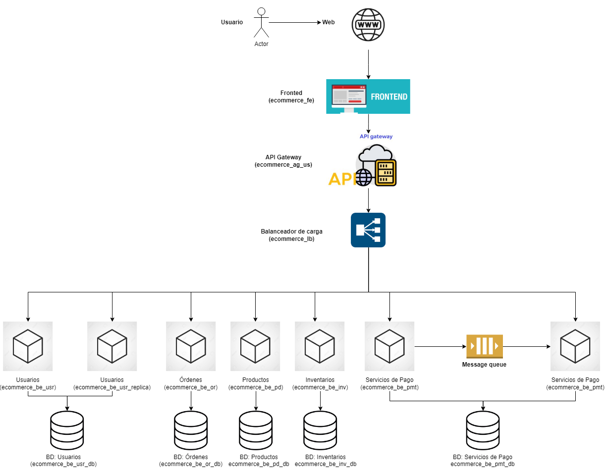
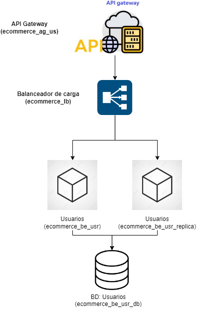
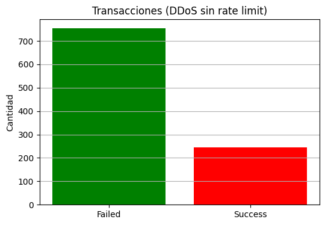

# Arquitectura distribuida basada en microservicios para un E-commerce 

#### Sergio Andrés Cabezas
#### Jilkson Alejandro Pulido Cruz
#### Diego Alejandro Rodriguez Martinez
#### Yosman Alexis Arenas Jimenez
#### Juan David Ramírez Ávila

El objetivo principal de esta segunda entrega es realizar un proceso iterativo de diseño parcial y verificación de la arquitectura de distribuida basada en microservicios para un E-commerce, que se propuso en la primera entrega, mediante un enfoque práctico y estructurado que permita evaluar atributos de calidad clave como la seguridad y la escalabilidad.

---

## 1. Visión general
La arquitectura propuesta para el sistema de e-commerce se basa en principios de **microservicios desacoplados**, altamente escalables y seguros. El diseño permite gestionar de manera independiente cada dominio de negocio: usuarios, pedidos, productos, inventario y pagos, con comunicación eficiente a través de protocolos adecuados, como HTTP para interacciones tradicionales y MQTT para los eventos relacionados con el servicio de pagos.

El flujo completo desde el cliente hasta el procesamiento de pagos se maneja de forma **modular**, mejorando la resiliencia, seguridad, escalabilidad y mantenibilidad del sistema.

---

## 2. Arquitectura del sistema 

A continuación, se presenta un diagrama de arquitectura de componentes y conectores. En la que se incluyo una replica del micro-servicios de usuarios, en relación a la arquitectura, que se expuso en la primera entrega del proyecto. 

La replicación del microservicio de usuarios para la arquitectura del e-commerce se hizo con el fin de garantizar la escalabilidad, permitiendo atender múltiples solicitudes concurrentes; alta disponibilidad, asegurando continuidad del servicio ante fallos; y mejor rendimiento, reduciendo la latencia en operaciones críticas como el inicio de sesión. Además, permite realizar mantenimientos sin interrupciones y adaptarse dinámicamente a la carga, mejorando la experiencia del usuario y la resiliencia del sistema. A continuación, se aprecia una imagen en donde se visualiza la arquitectura del sistema. 

## 3. Flujo elegido de la arquitectura del sistema 

Para realizar el proceso de verificación de los atributos de seguridad y escalabilidad, se eligió el flujo de la arquitectura que va desde el API Gateway —encargado de recibir las solicitudes del frontend— hasta el balanceador de carga, que distribuye las peticiones entre los microservicios. En el contexto de este proyecto, el proceso de verificación se centrará únicamente en el microservicio de usuarios y su respectiva réplica. Consecutivamente, se presenta una imagen con la extracción, de la parte de la arquitectura a analizar: 

## 4. Iteración 1 

La arquitectura seleccionada corresponde a un fragmento clave del e-Commerce. En el flujo elegido se aplican principios de **arquitectura de microservicios** con énfasis en los atributos de calidad de:

- **Escalabilidad**: Capacidad de adaptarse a aumentos en la carga de trabajo de forma eficiente.
- **Seguridad**: Protección frente a accesos no autorizados y ataques comunes, garantizando confidencialidad, integridad y disponibilidad.

### 4.1 Componentes y tácticas asociadas

En este apartado del documento, se presenta una breve descripción de cada uno de los componentes del flujo elegido arquitéctonico seleccionado para desarrollar la iteración uno y se enfonca la descripción de cada componente, en lo que esta relacionado con el atributo de calidad de seguridad. 

#### 4.1.1. **API Gateway** (`ecommerce_ag_us`)

- **Responsabilidad**: Es el punto de entrada al sistema. Filtra, enruta y valida solicitudes provenientes del cliente.

- **Tácticas de seguridad**:
  - `Authentication Enforcement`: gestión centralizada de autenticación.
  - `Input Validation`: inspección y validación de solicitudes entrantes.
  - `Authorization`: control de acceso a recursos protegidos.
---

#### 4.1.2. **Balanceador de Carga** (`ecommerce_lb`)

- **Responsabilidad**: Distribuye solicitudes entrantes de forma equitativa entre las instancias del microservicio de usuarios.

- **Tácticas de seguridad**:
  - `Failover`: redireccionamiento automático en caso de caída de instancia.

---

#### 4.1.3. **Microservicio de Usuarios**  
- Instancias: `ecommerce_be_usr` y `ecommerce_be_usr_replica`

- **Responsabilidad**: Gestionar operaciones de usuarios (registro, login, modificación de datos, etc.).

- **Tácticas de seguridad**:
  - `Secure Communication`: canal seguro (HTTPS) para la transmisión de datos sensibles.

---

#### 4.1.4. **Base de Datos de Usuarios** (`ecommerce_be_usr_db`)

- **Tácticas de seguridad**:
  - `Access Control`: solo microservicios autorizados pueden conectarse.

---
Al analizar el flujo arquitectónico elegido en la primera entrega, se observa que el sistema carece de un mecanismo de control de frecuencia, es decir, no existen límites definidos para el uso de los recursos o el número de solicitudes permitidas en un periodo de tiempo. Esta ausencia deja al sistema vulnerable a ataques de Denegación de Servicio (DoS), donde un atacante podría saturar los servicios mediante solicitudes excesivas, comprometiendo tanto la disponibilidad como la estabilidad del sistema. 

Por lo tanto, se simula un ataque de Denegación de Servicio (DoS) sobre el flujo seleccionado del sistema. En este escenario, se modela una situación en la que el sistema recibe N solicitudes concurrentes, sin contar con mecanismos de protección. Cada solicitud sigue una ruta aleatoria desde el frontend hasta la base de datos, exponiendo así las debilidades de la arquitectura ante cargas excesivas y mostrando la necesidad de implementar tácticas de seguridad.

Con base en la simulación, corrida se aprecia, que al exponer al sistema a una gran cantidad de peticiones, la mayoría de estas van a fallar, por ejemplo, al simular 1000 solicitudes simultáneas, fallaron 754 (75,4%) y exitosas, fueron (32.6 %), con esto se evidencia la necesidad, de aplicar una táctica de seguridad con el objetivo, de que el sistema, sea capaz de soportar, grandes cantidades de solicitudes concurrentes. Lo descrito, se confirma con la siguiente gráfica: 

