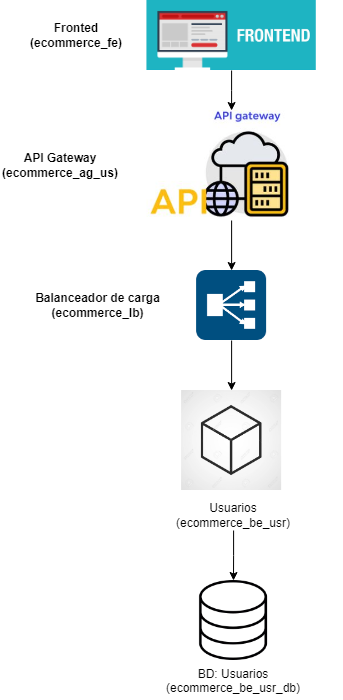

# Arquitectura distribuida basada en microservicios para un E-commerce 

#### Sergio Andrés Cabezas
#### Jilkson Alejandro Pulido Cruz
#### Diego Alejandro Rodriguez Martinez
#### Yosman Alexis Arenas Jimenez
#### Juan David Ramírez Ávila

---
El objetivo principal de esta segunda entrega es realizar un proceso iterativo de diseño parcial y verificación de la arquitectura distribuida basada en microservicios para un E-commerce, que se propuso en la primera entrega, mediante un enfoque práctico y estructurado que permita evaluar atributos de calidad clave como la seguridad y la escalabilidad.

## 1. Visión general
La arquitectura propuesta para el sistema de e-commerce se basa en principios de **microservicios desacoplados**, altamente escalables y seguros. El diseño permite gestionar de manera independiente cada dominio de negocio: usuarios, pedidos, productos, inventario y pagos, con comunicación eficiente a través de protocolos adecuados, como HTTP para interacciones tradicionales y MQTT para los eventos relacionados con el servicio de pagos.

El flujo completo desde el cliente hasta el procesamiento de pagos se maneja de forma **modular**, mejorando la resiliencia, seguridad, escalabilidad y mantenibilidad del sistema.

## 2. Arquitectura del sistema 

A continuación, se presenta un diagrama de arquitectura de componentes y conectores, que se expuso en la primera entrega del proyecto. 

Adicionalmente, utilizando las librerías de grafos vistas en clase también se construyó el diagrama de componentes y conectores, como se aprecia seguidamente: 

## 3. Flujo elegido de la arquitectura del sistema 

Para realizar el proceso de verificación de los atributos de seguridad y escalabilidad, se eligió el flujo de la arquitectura que va desde el API Gateway —encargado de recibir las solicitudes del frontend— hasta el balanceador de carga, que distribuye las peticiones entre los microservicios. En el contexto de este proyecto, el proceso de verificación se centrará únicamente en el microservicio de usuarios. Consecutivamente, se presenta una imagen con la extracción, de la parte de la arquitectura a analizar: 

## 4. Iteración 1 

La arquitectura seleccionada corresponde a un fragmento clave del e-Commerce. En el flujo elegido se aplican principios de **arquitectura de microservicios** con énfasis en los atributos de calidad de:

- **Escalabilidad**: Capacidad de adaptarse a aumentos en la carga de trabajo de forma eficiente.
- **Seguridad**: Protección frente a accesos no autorizados y ataques comunes, garantizando confidencialidad, integridad y disponibilidad.

### 4.1 Componentes y tácticas asociadas

En este apartado del documento, se presenta una breve descripción de cada uno de los componentes del flujo elegido arquitéctonico seleccionado para desarrollar la iteración uno y se enfonca la descripción de cada componente, en lo que esta relacionado con el atributo de calidad de seguridad. 

#### 4.1.1. **API Gateway** (`ecommerce_ag_us`)

- **Responsabilidad**: Es el punto de entrada al sistema. Filtra, enruta y valida solicitudes provenientes del cliente.

- **Tácticas de seguridad**:
  - `Authentication Enforcement`: gestión centralizada de autenticación.
  - `Input Validation`: inspección y validación de solicitudes entrantes.
  - `Authorization`: control de acceso a recursos protegidos.

#### 4.1.2. **Balanceador de Carga** (`ecommerce_lb`)

- **Responsabilidad**: Distribuye solicitudes entrantes de forma equitativa entre las instancias del microservicio de usuarios.

- **Tácticas de seguridad**:
  - `Failover`: redireccionamiento automático en caso de caída de instancia.

#### 4.1.3. **Microservicio de Usuarios**  
- Instancias: `ecommerce_be_usr` y `ecommerce_be_usr_replica`

- **Responsabilidad**: Gestionar operaciones de usuarios (registro, login, modificación de datos, etc.).

- **Tácticas de seguridad**:
  - `Secure Communication`: canal seguro (HTTPS) para la transmisión de datos sensibles.

#### 4.1.4. **Base de Datos de Usuarios** (`ecommerce_be_usr_db`)

- **Tácticas de seguridad**:
  - `Access Control`: solo microservicios autorizados pueden conectarse.

Al analizar el flujo arquitectónico elegido en la primera entrega, se observa que el sistema carece de un mecanismo de control de frecuencia, es decir, no existen límites definidos para el uso de los recursos o el número de solicitudes permitidas en un periodo de tiempo. Esta ausencia deja al sistema vulnerable a ataques de Denegación de Servicio (DoS), donde un atacante podría saturar los servicios mediante solicitudes excesivas, comprometiendo tanto la disponibilidad como la estabilidad del sistema. 

Por lo tanto, se simula un ataque de Denegación de Servicio (DoS) sobre el flujo seleccionado del sistema. En este escenario, se modela una situación en la que el sistema recibe N solicitudes concurrentes, sin contar con mecanismos de protección. Cada solicitud sigue una ruta aleatoria desde el frontend hasta la base de datos, exponiendo así las debilidades de la arquitectura ante cargas excesivas y mostrando la necesidad de implementar tácticas de seguridad.

Con base en la simulación, corrida se aprecia, que al exponer al sistema a una gran cantidad de peticiones, la mayoría de estas fallan, por ejemplo, al simular 1000 solicitudes simultáneas, fallaron 754 (75,4%) y 246 exitosas, fueron (32.6 %), con esto se evidencia la necesidad, de aplicar una táctica de seguridad con el objetivo, de que el sistema, sea capaz de soportar, grandes cantidades de solicitudes concurrentes. Lo descrito, se confirma con la siguiente gráfica: 

Adicionalmente, en la siguiente gráfica es posible apreciar los fallos por componente reportados por la simulación, en la que se aprecia, que la mayoría de las fallas se dieron el el microservicio de usuario, seguido por las fallas que se reportaron en el balanceador de carga. 

## 5. Iteración 2

En esta segunda iteración se introduce una táctica arquitectónica orientada a **mitigar vulnerabilidades de seguridad**, específicamente aquellas asociadas con ataques de **Denegación de Servicio (DoS)** o **Denegación de Servicio Distribuido (DDoS)**. 

Durante la **Iteración 1**, se evidenció que la arquitectura inicial no implementaba ningún tipo de **control de frecuencia de solicitudes**, lo que la dejaba completamente expuesta a este tipo de amenazas. Como respuesta, se decidió implementar una **táctica de seguridad conocida como _Rate Limiting_**, que permite regular el tráfico entrante hacia el sistema.

### 5.1 ¿Qué es *Rate Limiting* y por qué es una táctica arquitectónica?

 **Rate Limiting** es una **táctica arquitectónica de seguridad** ampliamente adoptada para controlar el número de solicitudes que una entidad (usuario, IP, sistema externo) puede realizar en un período determinado. Esta táctica permite:

- **Reducir la superficie de ataque**, evitando que actores maliciosos sobrecarguen el sistema.
- **Preservar la disponibilidad** de servicios críticos ante condiciones de alto tráfico.
- **Estabilizar la carga del sistema**, especialmente cuando se trabaja con recursos limitados como conexiones a base de datos o hilos de procesamiento.

En este contexto, Rate Limiting se ubica en la capa del **API Gateway**, el punto de entrada del sistema. Allí, actúa como **primer filtro**, evaluando si cada nueva solicitud debe ser aceptada o rechazada, en función de la carga actual del sistema.

En la simulación se lanzaron 1000 solicitudes concurrentes,  y se obtuvieron los resultados que se aprecian en la siguiente gráfica: 

En la gráfica de "Transacciones con Rate Limiting (Iteración 2)", se aprecia que al aplicar la táctica arquitectónica de Rate Limiting, se aprecia que 30 solicitudes, fueron exitosas y el resto debe esperar o será descartado si no hay capacidad. De esta forma, se evita que el sistema colapse en caso de que reciba un gran número de peticiones concurrentes. 

Adicionalmente, se presenta la gráfica "Fallos por componente (con Rate Limiting)", en la que se visualiza, que el número de fallos disminuye en relación a la gráfica "Fallos por componente (Iteración 1)", y la mayoría de las fallas se dan en el micro-servicio de usuarios,seguido del balanceador de carga.  

### 5.2 Flujo Arquitectónico Simulado

1. Una solicitud ingresa al sistema por el **frontend**.
2. Llega al **API Gateway**, donde se aplica la táctica de **Rate Limiting**.
3. Si la solicitud **se aprueba**, se enruta hacia el **microservicio de usuarios** y, finalmente, hacia una **base de datos**.
4. Si **no se aprueba** (por sobrepasar el límite), la solicitud se **rechaza inmediatamente**.

### 5.3 Impacto Arquitectónico

La inclusión del **Rate Limiting** como táctica aporta varias mejoras notables:

- **Robustez** frente a amenazas externas.  
- **Aislamiento y protección** de servicios internos.  
- **Desacoplamiento** de responsabilidades entre gateway y backend.  
- **Mayor resiliencia** ante tráfico irregular o malicioso.

Desde el punto de vista del diseño arquitectónico, esta iteración no solo **mitiga un riesgo** identificado previamente, sino que introduce un **patrón emergente de defensa perimetral**, reforzando el principio de **"defense in depth"**.

